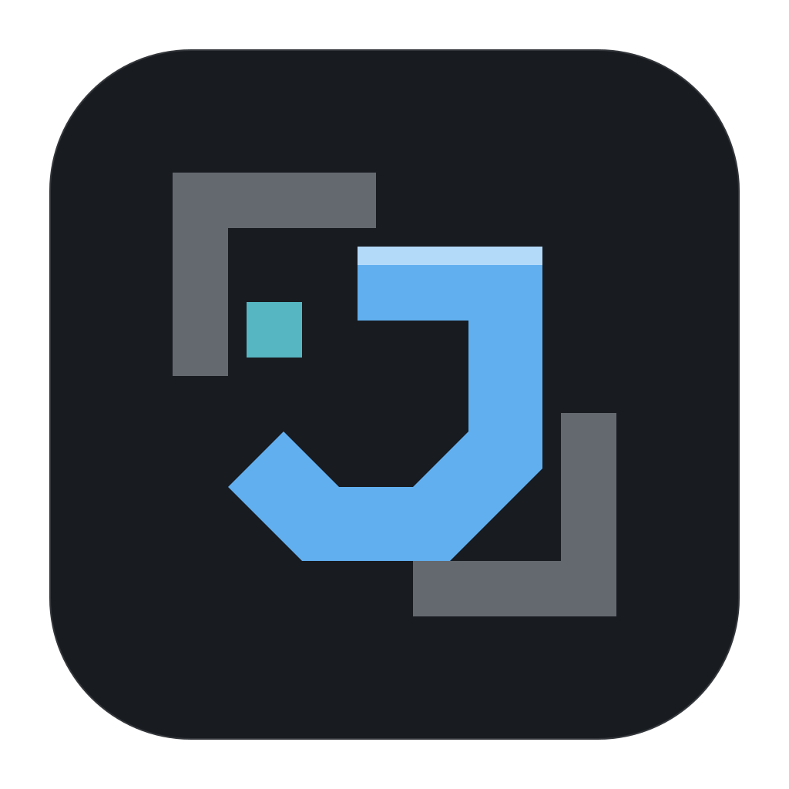

<p align="center">
  
</p>

<h1 align="center">Jarvis</h1>

<p align="center">
  <strong>Seus projetos, modelos e agentes em um só lugar.</strong><br />
  Um aplicativo desktop para desenvolver software com inteligência artificial.
</p>

<p align="center">
  <a href="https://github.com/paulovnas/jarvis/releases"></a>
  
  
</p>

<p align="center">
  <a href="https://github.com/paulovnas/jarvis/releases">Baixar Jarvis</a> ·
  <a href="#primeiros-passos">Primeiros passos</a> ·
  <a href="#desenvolvimento">Desenvolvimento</a>
</p>

## O que é o Jarvis

O Jarvis reúne conversas com IA, arquivos do projeto, planejamento e acompanhamento de tarefas em uma interface nativa. Você conecta seus provedores, escolhe os modelos de cada agente e acompanha o trabalho sem alternar entre várias ferramentas.

Os agentes podem ler e editar arquivos, executar comandos e realizar verificações como testes unitários, lint, checagem de tipos e compilação. A validação final da experiência fica com você: nos fluxos Planejado e Completo, o aplicativo apresenta os itens para testar, registra sua aprovação ou reprovação e encaminha o resultado aos agentes.

**Versão atual: 0.8.0 Beta.** A primeira distribuição é para **macOS com Apple Silicon**. O aplicativo está em evolução; problemas podem ser relatados nas [issues do projeto](https://github.com/paulovnas/jarvis/issues).

## O que você encontra

- **Organização por Workspace → Projeto → Conversa.** Agrupe seus projetos, escolha suas pastas locais e retome as conversas de onde parou.
- **Chat com contexto.** Anexe imagens e documentos, selecione skills com `/`, responda perguntas interativas e deixe mensagens na fila enquanto o agente trabalha.
- **Histórico sob demanda.** Navegue por conversas longas sem carregar tudo de uma vez. A compactação automática ajuda a manter o contexto dentro do limite do modelo e fica registrada no histórico.
- **Acompanhamento do projeto.** Veja indicadores no Dashboard, tarefas no Kanban, planos, subagentes e a janela de contexto. Os arquivos alterados mostram diferenças de linhas da sessão que ainda não foram commitadas.
- **Ferramentas configuráveis.** Use pesquisa na web, análise de imagens, servidores MCP e skills instaladas localmente ou pelo Marketplace.
- **Processos persistentes.** Acompanhe servidores e comandos que continuam em execução e encerre-os pelo chat quando necessário.
- **Seu espaço preservado.** Posição da janela, painéis e preferências são restaurados ao reabrir. A limpeza de conversas antigas mantém pelo menos a mais recente de cada projeto.

## Fluxos de trabalho

| Fluxo | Para que serve |
| --- | --- |
| **Padrão** | Trabalhar diretamente com o Construtor em uma implementação ou ajuste. |
| **Designer** | Definir a direção visual com perguntas, referências, sistemas de design e recursos de interface. |
| **Planejado** | Planejar com o Planejador e delegar a execução ao Construtor e ao Designer conforme a necessidade. |
| **Completo** | Coordenar planejamento, investigação, documentação, design, construção e revisão com agentes especializados. |

Em **Configurações → Agentes**, escolha o provedor, modelo e nível de raciocínio de cada papel. Os nomes e as instruções dos agentes são definidos pelo Jarvis. Os fluxos Planejado e Completo exigem que os modelos dos seus agentes estejam configurados antes de começar.

A execução de ferramentas é automática, dentro das permissões de cada papel. Revise o trabalho pelos arquivos alterados e pelas tarefas de validação antes de considerar uma entrega concluída.

## Core

O Core integra quatro ferramentas ao funcionamento do Jarvis. A instalação inicial é obrigatória e acontece pelo próprio aplicativo, em **Configurações → Geral → Core**. Os componentes ficam em `~/.jarvis`, com versão instalada, progresso de instalação e indicação de atualizações.

| Componente | Papel no Jarvis |
| --- | --- |
| [Context-mode](https://github.com/mksglu/context-mode) | Indexação e busca de conteúdo para trabalhar com grandes volumes de informação e reduzir o conteúdo necessário no contexto. |
| [Ponytail](https://github.com/DietrichGebert/ponytail) | Orientações de execução para os agentes, integradas às regras do fluxo de trabalho. |
| [Beads](https://github.com/gastownhall/beads) | Acompanhamento de épicos, tarefas, dependências e comentários, com visualização no Kanban e nos planos do projeto. |
| [Open Design](https://github.com/nexu-io/open-design) | Recursos de design, como referências, templates, sistemas de design e skills, usados pelo Designer. |

## Primeiros passos

1. Baixe o `.dmg` em [Releases](https://github.com/paulovnas/jarvis/releases), abra-o e copie o Jarvis para **Aplicativos**.
2. Abra a cópia instalada e conclua a preparação do Core. O download dos recursos de design pode levar alguns minutos.
3. Pelo botão de configurações no rodapé, conecte um provedor e escolha os modelos que deseja usar.
4. Crie um workspace para agrupar os projetos e adicione um projeto selecionando sua pasta local.
5. Inicie uma conversa, escolha o fluxo e descreva o que deseja fazer.

Esta primeira beta tem assinatura do aplicativo e das atualizações, mas **ainda não possui notarização Apple**. O macOS pode pedir uma autorização adicional para abri-la; consulte **Ajustes do Sistema → Privacidade e Segurança** se isso acontecer.

### Provedores e modelos

O Jarvis permite conectar várias contas e ativá-las ou desativá-las sem perder a configuração:

| Provedor | Conexão |
| --- | --- |
| **OpenAI Codex** | Login com sua conta ChatGPT pelo navegador. |
| **Antigravity** | Login pelo navegador, com o catálogo de modelos disponível para sua conta. |
| **Custom** | Alias próprio, URL base, chave de API e um dos protocolos: OpenAI Chat Completions, OpenAI Responses ou Anthropic Messages. |

O seletor do chat organiza as opções por provedor, modelo e raciocínio. Para modelos Custom do OpenRouter, informar o ID exato permite buscar dados do catálogo, como janela de contexto e capacidades; quando necessário, os campos também podem ser preenchidos manualmente.

Na statusbar, acompanhe os limites das contas compatíveis, o tempo até a renovação e a reserva ou o déficit de uso. A visibilidade desses dados pode ser configurada por conta.

### Pesquisa, imagens, MCPs e skills

Em **Configurações → Provedores → Ferramentas**, **Web Search** e **Vision** podem herdar o provedor e o modelo do chat ou usar uma seleção própria. Assim, uma ferramenta pode usar um modelo diferente daquele que conduz a conversa. A disponibilidade depende das capacidades do provedor e do modelo; pesquisa hospedada não é presumida para endpoints Custom.

Na aba **MCPs**, adicione servidores locais ou remotos, confira as ferramentas descobertas e ative ou desative cada integração. O modelo Context7 vem preparado para receber sua chave de API. Servidores executados com `npx` precisam de Node.js e npm disponíveis no computador.

Na aba **Skills**, consulte os detalhes, instale pelo Marketplace, atualize, desative ou exclua skills. O Jarvis lê sua pasta de skills em `~/.jarvis` e pode incluir `.agents/skills` global e do projeto, inclusive pastas vinculadas por atalhos simbólicos. As skills ativas ficam disponíveis para descoberta pelos agentes e podem ser selecionadas explicitamente com `/` no chat.

## Dados e privacidade

Configurações, histórico e dados locais ficam em `~/.jarvis`. As credenciais dos provedores são protegidas pelo **Acesso às Chaves do macOS (Keychain)**. A comunicação com os modelos usa as contas que você configurou; prompts, anexos e conteúdo necessário das ferramentas são enviados aos serviços utilizados na conversa.

Excluir um projeto no Jarvis remove seu registro e histórico no aplicativo, após confirmação. **A pasta e os arquivos do projeto no disco não são apagados.**

## Atualizações

O rodapé mostra a versão instalada. Quando existe uma versão compatível mais recente, aparece **Atualização Disponível**. Ao clicar, você pode ler as notas e escolher **Atualizar e reiniciar**.

O aplicativo mostra o progresso do download, verifica a assinatura e reabre após a instalação. Se a nova janela não confirmar a abertura, a anterior permanece aberta e permite tentar novamente. Aguarde as execuções e encerre os processos ativos antes de atualizar.

A primeira versão com esse recurso precisa ser instalada manualmente. Versões beta recebem novas prévias e versões estáveis; instalações estáveis recebem apenas versões estáveis.

## Desenvolvimento

O projeto usa **Tauri v2 e Rust** no backend, com **React 19, TypeScript, Tailwind CSS v4 e shadcn/ui** na interface. A direção visual combina painéis de grafite, componentes compactos, Roboto e JetBrains Mono, com a borda neon do chat indicando execução.

Para desenvolver no macOS, instale [Bun](https://bun.sh/), [Rust](https://www.rust-lang.org/tools/install), Git e as ferramentas de desenvolvimento do Xcode. Confira também os [pré-requisitos do Tauri](https://v2.tauri.app/start/prerequisites/).

```bash
git clone https://github.com/paulovnas/jarvis.git
cd jarvis
bun install
bun run tauri dev
```

Os comandos `bun run tauri dev` e `bun run tauri build` usam uma identidade Apple de assinatura estável, para preservar a identidade do aplicativo no Keychain entre compilações. Configure um certificado **Apple Development** no Xcode para desenvolvimento local. Se houver mais de um certificado, indique qual usar:

```bash
security find-identity -v -p codesigning
export APPLE_SIGNING_IDENTITY="<hash do certificado escolhido>"
bun run tauri dev
```

Para visualizar apenas a interface, use `bun run dev` e acesse `http://localhost:1420`. As funções nativas exigem o aplicativo Tauri.

### Verificações

```bash
# Lint, checagem de tipos, testes e compilação da interface.
bun run check

# Verificações do backend nativo.
cargo clippy --manifest-path src-tauri/Cargo.toml --all-targets -- -D warnings
cargo test --manifest-path src-tauri/Cargo.toml
```

### Publicar uma versão

Com as alterações commitadas e a branch `main` sincronizada com o GitHub:

```bash
# Simular sem alterar arquivos nem publicar.
bun run release 0.8.0-beta.2 --dry-run

# Compilar, assinar e publicar a próxima beta.
bun run release 0.8.0-beta.2 --notes-file /caminho/notas-da-versao.md
```

O comando executa as verificações, gera os instaladores e arquivos de atualização, cria a tag e publica a versão no GitHub. Consulte o [guia de publicação](docs/RELEASING.md) para configurar as chaves, escolher a arquitetura e manter as assinaturas entre versões.

## Autoria

Criado por **[Paulo Vitor Nascimento](https://github.com/paulovnas)**.
