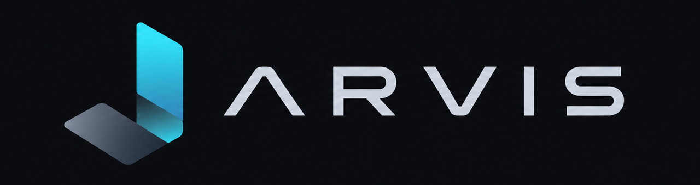

<p align="center">
  
</p>

<p align="center">
  <strong>Seus projetos, modelos e agentes em um só lugar.</strong><br />
  Um aplicativo desktop para desenvolver software de forma assistida por inteligência artificial.
</p>

<p align="center">
  <a href="https://github.com/paulovnas/jarvis/releases"></a>
  
  
  
</p>

<p align="center">
  <a href="https://github.com/paulovnas/jarvis/releases">Baixar Jarvis</a> ·
  <a href="#primeiros-passos">Primeiros passos</a> ·
  <a href="#desenvolvimento">Desenvolvimento</a>
</p>

## O que é o Jarvis

O Jarvis reúne conversas com IA, arquivos, terminais, navegador, planejamento e acompanhamento de tarefas em uma interface desktop. Você conecta seus próprios provedores, escolhe os modelos de cada agente e acompanha o trabalho em vários projetos sem perder o contexto.

Os agentes podem investigar o projeto, consultar documentação, editar arquivos, executar comandos, navegar pelo código, usar MCPs e realizar verificações. Operações sensíveis, validações e publicações podem ser apresentadas para sua revisão antes da execução.

O Jarvis está em beta e evolui continuamente. Relate problemas e sugestões nas [issues do projeto](https://github.com/paulovnas/jarvis/issues).

## Principais recursos

| Área | O que o Jarvis oferece |
| --- | --- |
| **Organização** | Workspaces, projetos e conversas persistentes, reordenação por arrastar e soltar, rascunhos por chat e indicadores de atividade, mensagens não lidas e terminais abertos. |
| **Chat** | Raciocínio em tempo real, chamadas de ferramentas agrupadas, blocos de código destacados, anexos, imagens geradas, perguntas interativas e fila de mensagens que pode ser reordenada, editada ou enviada durante a execução. |
| **Agentes e fluxos** | Agentes nativos e personalizados, uso individual ou em fluxos, permissões por ferramenta e editor visual em canvas. Alterações de agentes e fluxos feitas pela IA exigem aprovação. |
| **Planejamento** | Tasks para agentes diretos e planos persistentes com épicos, tarefas, dependências, comentários e validações nos fluxos Planejado e Completo. |
| **Ambiente** | Explorer, visualização de arquivos, diff das alterações, terminal configurável, processos persistentes, navegador integrado, LSP e patch transacional. |
| **Detalhes do projeto** | Métricas de uso, atividade dos agentes, Kanban e opções próprias de publicação para cada projeto. |
| **Desktop** | Notificações do sistema, badges de mensagens não lidas, prevenção de repouso, atalhos controlados, backup de configurações e atualização automática do aplicativo e dos recursos. |

## Fluxos e agentes

Os fluxos nativos cobrem diferentes níveis de coordenação:

| Fluxo | Para que serve |
| --- | --- |
| **Padrão** | Trabalhar diretamente com o Construtor em implementações e ajustes gerais. |
| **Designer** | Investigar, projetar e implementar interfaces com foco em experiência e acabamento visual. |
| **Planejado** | Criar um plano persistente e delegar a execução aos agentes adequados. |
| **Completo** | Coordenar planejamento, investigação, documentação, design, construção e revisão. |

Em **Configurações → Workflow**, você pode consultar as instruções dos agentes nativos, selecionar provedor, modelo e raciocínio e criar seus próprios agentes e fluxos. Agentes personalizados podem ser individuais, exclusivos de fluxos ou mistos. Os fluxos nativos também podem ser visualizados no canvas em modo somente leitura.

Nos fluxos Planejado e Completo, o Inspector acompanha o agente em atividade, o plano da conversa, os itens de validação e os arquivos alterados. Nos modos diretos, a lista de tasks mostra o trabalho concluído, atual e pendente.

## Core

O Core integra seis recursos essenciais ao harness do Jarvis. A instalação inicial é obrigatória e guiada; depois, versões, integridade, atualizações, diagnóstico e reparo ficam em **Configurações → Ferramentas → Core**. Os pacotes gerenciados são armazenados em `~/.jarvis`.

| Componente | Papel no Jarvis |
| --- | --- |
| [Context-mode](https://github.com/mksglu/context-mode) | Indexa e recupera conteúdo sob demanda para economizar contexto em leituras, buscas e análises extensas. |
| [Ponytail](https://github.com/DietrichGebert/ponytail) | Fornece diretrizes de execução e revisão de código para reduzir ruído e retrabalho. |
| [Beads](https://github.com/gastownhall/beads) | Mantém épicos, tarefas, dependências e comentários persistentes por projeto. |
| [Open Design](https://github.com/nexu-io/open-design) | Disponibiliza sistemas visuais, referências, templates e recursos usados pelo Designer. |
| [Context7](https://github.com/upstash/context7) | Consulta documentação e exemplos atualizados de bibliotecas. A chave fica no armazenamento seguro do sistema. |
| [Servidores LSP](https://github.com/typescript-language-server/typescript-language-server) | Localiza definições, referências, símbolos e diagnósticos em projetos TypeScript, JavaScript e Python. Rust e Go usam a toolchain do projeto quando disponível. |

Se um componente obrigatório estiver ausente ou inválido, o Jarvis bloqueia novas interações e abre o fluxo de **Diagnóstico e Reparo** para corrigir ou reinstalar o recurso.

## Provedores, ferramentas e extensões

O Jarvis aceita várias contas, que podem ser ativadas ou desativadas sem perder a configuração:

| Provedor | Conexão |
| --- | --- |
| **OpenAI Codex** | Login com a conta ChatGPT pelo navegador. |
| **Antigravity** | Login pelo navegador e catálogo compatível com a conta conectada. |
| **Custom** | Alias próprio, URL base, chave de API e protocolo OpenAI Chat Completions, OpenAI Responses ou Anthropic Messages. |

Modelos Custom podem receber contexto, capacidades e níveis de raciocínio do catálogo quando o ID é reconhecido, ou ser configurados manualmente. O seletor do chat organiza provedor, modelo e raciocínio e preserva a escolha por conversa.

Em **Configurações → Provedores → Ferramentas**, Web Search e Vision podem herdar o modelo do chat ou usar outra seleção. A geração de imagens usa um provedor Antigravity compatível e apresenta progresso e resultado diretamente na conversa.

Outras extensões ficam disponíveis sob demanda:

- **MCPs:** servidores locais ou remotos, teste de conexão, descoberta de ferramentas e ativação individual.
- **Skills:** instruções locais, pastas `.agents/skills` e atalhos simbólicos, Marketplace, detalhes em Markdown, atualização, ativação e remoção.
- **Ferramentas dos agentes:** busca de arquivos, terminal, processos, navegador, LSP, Context-mode, patch, perguntas, tarefas, leitura de skills e MCPs. Cada agente personalizado pode receber somente as permissões necessárias.

O catálogo enviado ao modelo é reduzido de acordo com a intenção e as permissões do agente. Resultados de leitura local podem ser reutilizados enquanto o arquivo não mudar, reduzindo chamadas e tokens desperdiçados.

## Detalhes e publicação assistida

A tela **Detalhes** possui três abas:

- **Geral:** métricas do projeto, conversas, tokens, cache, ferramentas e atividade recente.
- **Kanban:** tarefas persistentes, filtros, comentários e detalhes dos planos.
- **Opções:** instruções de commit e política de pull request próprias do projeto.

O botão **Publicar** no Inspector pede que a IA prepare uma proposta com os arquivos exatos, mensagens de commit, branches, pull requests e merges. A proposta aceita repositórios Git aninhados e só executa o que você aprovar. A opção de perguntar sobre PR ou PR e merge exige o [GitHub CLI](https://cli.github.com/) instalado e autenticado; cada autorização é explícita e descartável.

## Primeiros passos

Baixe a versão mais recente em [Releases](https://github.com/paulovnas/jarvis/releases):

- **macOS Apple Silicon:** abra o `.dmg` e copie o Jarvis para **Aplicativos**.
- **Windows x64:** execute o instalador `-setup.exe`. O Windows pode exibir um aviso de editor desconhecido enquanto o projeto não possui assinatura Authenticode.

O onboarding conduz cinco etapas:

1. Conhecer os recursos principais do Jarvis.
2. Instalar e configurar os seis componentes obrigatórios do Core.
3. Verificar **Git** e **GitHub CLI**. Os dois são opcionais; quando ausentes, o Jarvis oferece Homebrew no macOS, WinGet no Windows ou instruções oficiais compatíveis com o sistema.
4. Conectar ao menos um provedor e configurar as ferramentas de IA.
5. Dar um nome ao workspace padrão e adicionar a pasta do primeiro projeto.

Git é necessário para versionamento e publicação. O GitHub CLI é necessário somente para criar ou mesclar pull requests pelo Jarvis; autentique-o com `gh auth login` antes do primeiro uso.

O macOS pode pedir autorização adicional porque as versões atuais ainda não possuem notarização Apple. Use **Ajustes do Sistema → Privacidade e Segurança** se necessário. Atualmente não são distribuídos pacotes para macOS Intel, Windows ARM64 ou Linux.

## Conversas e experiência desktop

- O histórico é carregado sob demanda, e a compactação automática preserva o contexto quando a conversa se aproxima do limite configurado.
- O andamento mostra tempo de execução, raciocínio e grupos de ferramentas; ao finalizar, o painel recolhe para destacar a resposta.
- Mensagens escritas ficam salvas por conversa. Se o agente estiver trabalhando, novas mensagens podem entrar na fila ou ser enviadas imediatamente como orientação adicional.
- Notificações avisam sobre conclusão, perguntas, validações e falhas. Em fluxos coordenados, a conclusão pertence ao fluxo inteiro.
- Alertas de uso podem ser configurados por conta e janela de limite. A statusbar mostra consumo, reserva ou déficit, tempo até a renovação e a posição esperada pelo tempo decorrido.
- O terminal integrado respeita shell, argumentos, fonte e tamanho definidos pelo usuário. Terminais e processos pertencem à conversa que os criou.
- A opção de repouso pode ficar desligada, acompanhar execuções ativas ou permanecer ligada enquanto o Jarvis estiver aberto.

## Backup, dados e privacidade

Configurações, conversas, recursos e dados locais ficam em `~/.jarvis`. Credenciais são protegidas pelo **Acesso às Chaves** no macOS e pelo armazenamento seguro do Windows. Prompts, anexos e o conteúdo necessário das ferramentas são enviados somente aos provedores e serviços usados na conversa.

Em **Configurações → Geral → Exportar e importar**, um arquivo de backup reúne preferências, workspaces, agentes, fluxos, skills e MCPs. Provedores e credenciais não são exportados; após a importação, o Jarvis orienta o novo vínculo dos modelos.

Excluir um projeto remove seu registro e o histórico do Jarvis após confirmação. **A pasta e os arquivos do projeto no disco não são apagados.** Excluir um workspace também preserva as pastas dos projetos, mas remove seu histórico de conversas.

## Atualizações

Antes de abrir a interface principal, a tela de inicialização verifica configuração, Core, provedores e recursos necessários. Verificações não essenciais podem ser ignoradas; a consulta de atualizações de skills acontece fora desse caminho para manter a abertura rápida.

A statusbar informa quando há uma nova versão do aplicativo ou atualizações de recursos. A janela correspondente mostra notas, itens disponíveis e progresso, inclusive downloads sem tamanho total conhecido. Atualizações do app têm assinatura verificada e reiniciam o Jarvis automaticamente. Atualizações do Core e das skills são instaladas separadamente.

Versões beta recebem novas betas e versões estáveis; instalações estáveis recebem somente versões estáveis.

## Desenvolvimento

O projeto usa **Tauri v2 e Rust** no backend, com **React 19, TypeScript estrito, Tailwind CSS v4, shadcn/ui e Bun** na interface.

Instale [Bun](https://bun.sh/), [Rust](https://www.rust-lang.org/tools/install), Git e os [pré-requisitos do Tauri](https://v2.tauri.app/start/prerequisites/) para o seu sistema. No macOS, isso inclui as ferramentas do Xcode; no Windows, WebView2 e as ferramentas C++ do Visual Studio.

```bash
git clone https://github.com/paulovnas/jarvis.git
cd jarvis
bun install
bun run tauri dev
```

Para visualizar apenas a interface, execute `bun run dev` e abra `http://localhost:1420`. Recursos nativos exigem o aplicativo Tauri.

No macOS, as compilações de desenvolvimento usam uma identidade Apple estável para preservar o acesso ao Keychain. Se houver mais de um certificado **Apple Development**, informe qual deve ser usado:

```bash
security find-identity -v -p codesigning
export APPLE_SIGNING_IDENTITY="<hash do certificado>"
bun run tauri dev
```

### Verificações

```bash
# Lint, tipos, testes da interface e build de produção.
bun run check

# Backend nativo.
cargo clippy --manifest-path src-tauri/Cargo.toml --locked --all-targets -- -D warnings
cargo test --manifest-path src-tauri/Cargo.toml --locked
```

### Publicar uma versão

Com todas as alterações commitadas e `main` sincronizada com o GitHub:

```bash
# Validar o fluxo sem alterar arquivos.
bun run release 0.9.10-beta --dry-run

# Atualizar a versão, criar commit e tag e iniciar o GitHub Actions.
bun run release 0.9.10-beta
```

O pipeline valida frontend e Rust no macOS e no Windows, gera DMG e NSIS, assina os pacotes do atualizador e só então publica a release e os manifestos de ambas as plataformas. O comando pode ser iniciado no macOS, Windows ou Linux; Bun, Git e GitHub CLI autenticado são necessários apenas na máquina que dispara o release. As chaves permanecem nos secrets do CI. Consulte [docs/RELEASING.md](docs/RELEASING.md) para configuração, recuperação e limites de distribuição.

## Autoria

Criado por **[Paulo Vitor Nascimento](https://github.com/paulovnas)**. O Jarvis é desenvolvido sem fins lucrativos para ajudar pessoas que desejam criar software de forma assistida por IA.
