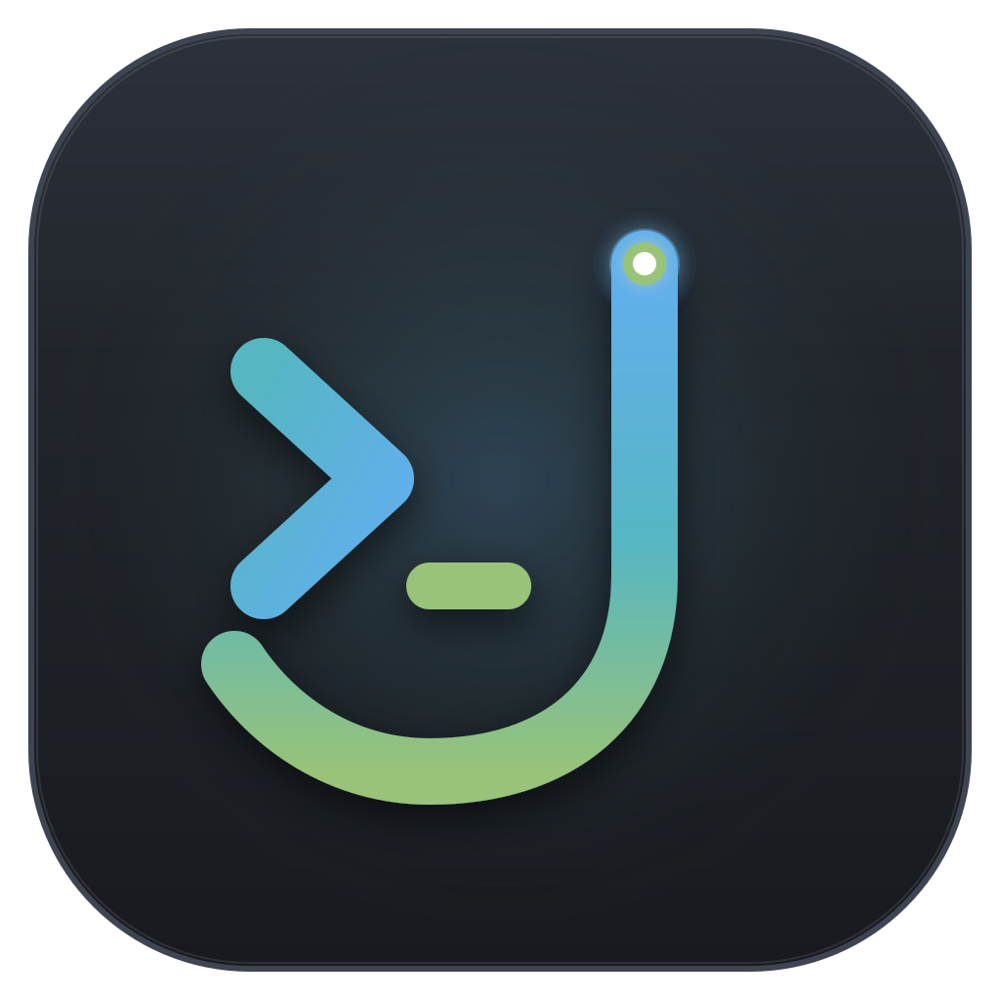

<p align="center">
  
</p>

<h1 align="center">Jarvis</h1>

<p align="center">
  <strong>Coding Agent Desktop GUI de Alta Performance</strong><br />
  Construído com <strong>Tauri v2 (Rust)</strong>, <strong>React 19</strong>, <strong>TypeScript</strong>, <strong>Tailwind CSS v4</strong> e <strong>shadcn/ui</strong>.
</p>

<p align="center">
  
  
  
  
  
  
</p>

---

## 🎯 Sobre o Jarvis

O **Jarvis** é uma interface desktop gráfica moderna, leve e autônoma projetada para engenharia de software assistida por IA. O projeto foi arquitetado do zero para oferecer uma experiência fluida, nativa e de baixo consumo de recursos através do **Tauri v2**:

- **Backend em Rust (`src-tauri`):** Gerenciamento do loop do agente, execução segura de comandos de terminal, manipulação direta de sistema de arquivos e comunicação com provedores de IA sem overhead de navegadores pesados.
- **Frontend em React 19 + TypeScript (`src`):** Interface reativa, modular e tipada, focada em renderização rápida de diffs, streaming de raciocínio, ferramentas e contexto de projeto.
- **Base de Conhecimento (`docs/metis`):** O projeto utiliza a arquitetura e fluxos do [metis](docs/metis) como referência conceitual e base de conhecimento obrigatória para projetar sessões, tools e integrações.

---

## Native agent workflows

The chat **Fluxo** selector offers **Padrão** (Construtor), **Planejado** (Planejador, Construtor and Designer) and **Completo** (Planejador, Investigador, Redator, Orquestrador, Designer, Construtor and Revisor). Names, instructions and role permissions are built into Jarvis.

Choose each role's account, model and reasoning in **Configurações > Agentes**. Planned and Complete require their role choices before running. Settings persist in `~/.jarvis/agents.json`; changes apply to the next run. The chat model picker changes the main role's profile. All agents execute tools automatically (YOLO), within their fixed role capabilities and assigned scope.

The inspector shows live execution cards and opens isolated, read-only transcripts. Native hub tools coordinate dependencies, waiting, cancellation and bounded recovery. Beads stores tasks and acceptance criteria; Complete requires independent approval for the exact tasks before closure. See [native workflow architecture](docs/architecture/native-workflows.md) for contracts and storage behavior.

## 🎨 Design System & Interface

O Jarvis possui um design system coeso e minimalista:

- **Tema One Dark:** Paleta canônica inspirada no Atom e VS Code One Dark Pro:
  - Fundo principal: `#282c34`
  - Superfícies e Cards: `#21252b`
  - Painéis secundários: `#2c313a`
  - Bordas: `#3e4451`
  - Acentos semânticos: Azul `#61afef` (primário), Verde `#98c379` (status/terminal), Ciano `#56b6c2` (workspace), Amarelo `#e5c07b` (chaves de API) e Vermelho `#e06c75` (destrutivo).
- **Tipografia:** Fonte **Roboto** (`@fontsource/roboto`) em todos os pesos tipográficos.
- **Componentes:** Todo elemento de UI é baseado em **shadcn/ui** e primitivos acessíveis.
- **Custom TitleBar Integrada:** Barra de título exclusiva, sem molduras nativas do SO (`decorations: false`), com suporte nativo a arrastar janela (`data-tauri-drag-region`), alternância de maximização por clique duplo e controles estilizados com hover de fechamento em vermelho One Dark.
- **Dimensões Padrão:** Janela configurada em `1360x768`, centralizada na tela na inicialização.
- **Notificações:** Sistema de toasts elegante com **Sonner**.

---

## 📁 Estrutura do Projeto

```text
jarvis/
├── docs/
│   └── metis/               # Base de conhecimento de arquitetura (somente leitura)
├── public/
│   └── logo.svg             # Logo vetorial canônica do Jarvis (1024x1024)
├── src/
│   ├── components/
│   │   ├── chat/                 # Componentes do chat central (mensagens, tools, colapso de trabalho, composer)
│   │   ├── layout/
│   │   │   ├── Home.tsx          # Shell desktop de 3 colunas redimensionáveis
│   │   │   ├── Home.test.tsx     # Testes unitários do shell Home
│   │   │   ├── Inspector.tsx     # Sidebar lateral direita colapsável de contexto
│   │   │   ├── Inspector.test.tsx # Testes unitários do Inspector
│   │   │   ├── Sidebar.tsx       # Sidebar lateral esquerda (Workspace, projetos, conversas)
│   │   │   ├── Sidebar.test.tsx  # Testes unitários da Sidebar esquerda
│   │   │   ├── TitleBar.tsx      # Barra de título customizada com controles Tauri
│   │   │   └── TitleBar.test.tsx # Testes unitários da barra de título
│   │   ├── ui/                   # 25+ componentes instalados via shadcn/ui
│   │   └── JarvisLogo.tsx        # Componente SVG reutilizável da logo
│   ├── hooks/               # Custom React hooks (ex: use-mobile)
│   ├── lib/                 # Utilitários (ex: cn / tailwind-merge)
│   ├── test/                # Setup de testes unitários (Vitest + JSDOM)
│   ├── App.tsx              # Tela de Onboarding e ponto de entrada da aplicação
│   ├── App.test.tsx         # Testes de integração e comportamento da UI
│   ├── index.css            # Configuração de temas, One Dark tokens e Roboto
│   └── main.tsx             # Inicialização React DOM
├── src-tauri/
│   ├── capabilities/        # Permissões do Tauri v2 (janela, drag, opener)
│   ├── icons/               # Ícones de plataforma (.ico, .icns, PNGs)
│   ├── src/                 # Código Rust do backend nativo
│   ├── Cargo.toml           # Dependências Rust
│   └── tauri.conf.json      # Configurações da aplicação desktop
├── AGENTS.md                # Regras normativas e diretrizes para agentes de IA
├── eslint.config.js         # ESLint flat config (regras estritas, zero warnings)
├── tsconfig.json            # Configuração TypeScript estrita com alias @/
└── vite.config.ts           # Configuração Vite com plugin Tailwind v4 e Tauri
```

---

## 🚀 Como Executar

### Pré-requisitos

- [Bun](https://bun.sh/) (recomendado) ou Node.js 20+
- [Rust](https://www.rust-lang.org/) e Cargo (para rodar com Tauri desktop)

### Instalação

```bash
bun install
```

### Modo Web (apenas frontend no navegador)

```bash
bun run dev
```

Acesse em `http://localhost:1420`.

### Modo Desktop (aplicação nativa com Tauri)

```bash
bun run tauri dev
```

#### Stable macOS signing and Keychain access

Use `bun run tauri dev`, `bun run tauri build`, or `bun run tauri build --debug --bundles app` for native development and local bundles. These commands select the single installed Apple application-signing certificate and share it with Cargo and Tauri. The dev runner signs the executable before every launch, including hot rebuilds, using the application's bundle identifier. The bundler signs the app with the same certificate. Other platforms and Tauri help/info commands do not require an Apple certificate.

If no certificate exists, create an **Apple Development** certificate through Xcode's account settings. If several certificates exist, select one explicitly in your shell:

```bash
security find-identity -v -p codesigning
export APPLE_SIGNING_IDENTITY="<certificate SHA-1 from the command above>"
bun run tauri dev
```

Keep that selection consistent across dev and bundled builds. Certificates, private keys and personal identity names are not stored in the repository. The wrapper stops on missing or ambiguous certificates instead of silently producing an ad hoc signature. Direct `cargo run` or `bunx tauri` bypasses this workflow. An Apple Development certificate is for local testing; public distribution requires the appropriate Developer ID signing and notarization setup. Tauri reports that notarization was skipped when those distribution credentials are absent; the local app is still signed.

Existing Keychain entries may require **Always Allow** once when moving from the previous ad hoc signature to the stable identity. Subsequent rebuilds retain that identity; a locked Keychain or a changed signing identity can still require authorization. Credentials remain in Keychain, and its access rules are not relaxed.

`bun run test:macos-keychain` compiles two different disposable native executables, signs both through the dev runner, and verifies that the second reads the first's temporary Keychain item with interaction disabled. It also checks that an unrelated app identifier is denied and removes the test item afterwards. This test requires macOS and an unlocked signing key; it never reads provider credentials.

### Provider accounts and models (OpenAI Codex)

In **Configurações > Provedores**, connect ChatGPT subscription accounts through the `openai-codex` provider. Account cards start collapsed with their alias, connection status and model count. Click a card header or use Enter/Space to reveal the email, account type, connection date, available models and disconnect action. Model availability failures remain visible in the collapsed summary. The chat selector uses the same account catalog, grouped by alias; it contains no sample models.

- **Immutable alias:** `openai-codex-<suffix>`, with 1–32 lowercase ASCII letters/digits and internal hyphens (`^[a-z0-9]+(?:-[a-z0-9]+)*$`). Renaming requires disconnecting and reconnecting. The same account cannot be connected under two aliases.
- **SQLite metadata:** `~/.jarvis/jarvis.db` stores `alias`, `provider_kind`, opaque `account_id` and `created_at`.
- **Keychain credentials:** Rust stores access/refresh tokens, expiry and optional account profile metadata in macOS Keychain under `com.foxtag.jarvis.openai-codex`. Tokens never cross IPC or enter SQLite. Account/model details returned to React contain no credentials.
- **Model namespace:** `<alias>/<model-id>` distinguishes the same model across accounts. Accepted turns persist their model, reasoning, execution mode and approval policy; reopening a conversation restores its latest choices.
- **Model reasoning:** Rust preserves each model's reported `supported_reasoning_levels` and `default_reasoning_level`. The menu uses only those options, including `none`, `minimal` or `xhigh` when supplied. Known levels have pt-BR labels; other valid identifiers retain the provider's value. The initial choice uses the reported default or the first reported option. Missing capabilities do not create a fixed list. If only a default is reported, it is the sole option; an explicitly empty or malformed list never gains invented levels.
- **Catalog refresh:** accounts are queried at startup and when Settings opens or account actions complete. Rust refreshes expiring credentials when loading account details. Credential reads/updates, connection commits and disconnections are serialized; a late catalog response cannot overwrite newer Settings state in the chat. A failed model query is shown explicitly in Settings. There is no periodic polling or inference request to probe model capabilities.

#### Browser OAuth flow

Choose **Adicionar conta**, enter a suffix, then choose **Conectar com ChatGPT**. Jarvis generates PKCE (S256) and `state`, opens OpenAI authorization in the default browser, and listens on `http://localhost:<port>/auth/callback`, trying ports `1455` then `1457`. Rust validates the callback state, exchanges the code, and commits the credential to Keychain and metadata to SQLite.

Account selection, login and consent happen in the browser. **Cancelar conexão** or closing Settings cancels a pending attempt; **Abrir navegador novamente** reuses the current authorization. Only one attempt may be active, with a ten-minute timeout. Errors use typed, redacted messages. **Desconectar** removes the Keychain credential before SQLite metadata; failed secret removal preserves metadata for retry.

#### Current exclusions

Device-code flow, alias renaming and secure credential storage on platforms other than macOS remain outside this implementation. Custom API-key endpoints are described below.

### Custom providers

In **Configurações > Provedores > Adicionar conta > Custom**, define the entire alias, base URL, API key and protocol: OpenAI Chat Completions, OpenAI Responses or Anthropic Messages. Jarvis appends `/chat/completions`, `/responses` or `/messages` to the base path unless it already ends in that endpoint. HTTPS is required except for local loopback HTTP. Messages accepts either Bearer authentication (gateways such as OpenRouter) or native `x-api-key` authentication. Completions exposes the `max_tokens` / `max_completion_tokens` compatibility choice.

For OpenRouter, enter the exact API model ID and leave the field to fill its name, limits and capabilities from the public catalog. The refresh icon also imports metadata for an existing model; opening a saved account never overwrites its values. The lookup uses no API key or inference, accepts only the known OpenRouter catalog, and caches responses for five minutes. Context uses the smaller catalog/top-provider limit, output uses the top-provider maximum, and reasoning levels come only from explicitly reported efforts. A previously selected default is preserved when still supported. Messages keeps provider-default thinking because catalog efforts do not establish an Anthropic budget. Missing metadata or other gateways fall back to **Configurar manualmente**, with field help. No limits are guessed from a model name.

Each model requires its exact API ID, display name, context window and maximum output tokens. Context must be at least 4,096 tokens and output must be positive and smaller than context. Declare image and tool support, and configure reasoning only when supported: protocol-specific effort, OpenRouter reasoning, DeepSeek thinking, or Anthropic budget/adaptive thinking. **Padrão do provedor** omits reasoning parameters; it does not disable server-default thinking. Budget thinking uses `off`/`on` and an explicit token budget below the output limit. **Compatibilidade avançada** contains token-field/authentication options and unsigned thinking replay for Messages gateways. The form enables replay with Bearer and disables it with native `x-api-key`; the user can override it. Signed and redacted thinking remain private replay data.

Configuration lives in `custom_provider_configs` in `~/.jarvis/jarvis.db`; the API key uses the native secure store and is never returned to the frontend. Saving and listing Custom providers are offline: neither operation triggers discovery, OAuth, a connection probe or inference. Metadata lookup happens separately in the model editor. Click the account card and **Editar** to change endpoint/models/key; leaving the key blank keeps the stored key. Alias identity stays fixed so conversation and agent selections remain stable. Disabling keeps the configuration and key; disconnecting removes both.

Custom models participate in chat, agent selection, title generation, context measurement and compaction. The compactor additionally reserves the configured output budget. Vision uses the declared image capability, including when inherited from the executing agent. Native hosted Web Search and subscription quotas are not advertised for arbitrary Custom endpoints; configure a supported dedicated search provider if needed. Streaming adapters translate text, images and tool round trips, preserve protocol-specific reasoning replay only for the originating account/model/endpoint, and reject interrupted/incomplete tool calls. Upstream error bodies and keys never enter user-facing errors.

Requests to the official OpenRouter HTTPS origin identify the application with `X-OpenRouter-Title: Jarvis` and `HTTP-Referer: https://github.com/paulovnas/jarvis`, across all three Custom protocols. These are transport headers, not model instructions or agent names. `X-OpenRouter-App-Visibility: hidden` requests private initial app attribution for the user's analytics; OpenRouter retains the visibility of existing app registrations. Other gateways receive none of these attribution headers. See [OpenRouter app attribution](https://openrouter.ai/docs/app-attribution).

### Web Search

Provider cards include an **Ativada/Desativada** switch. Disabling preserves the account and Keychain credentials, removes its models from the chat selector, and prevents new inference requests. Existing accounts migrate as enabled. A disabled Web Search account remains selected but unavailable until re-enabled; it never falls back to another account.

Below the accounts in **Configurações > Provedores**, **Web Search** defaults to **Desligado**. Select a connected OpenAI Codex account to enable the agent's `web_search` tool in both Plan and Build. The setting is global and persists in SQLite; disconnecting that account resets it to off. Search never falls back to another account or uses the conversation's model/account selection.

The Rust adapter makes a separate ChatGPT Responses request using the selected search account's Keychain credentials and catalog. Only the focused query is sent, without the conversation transcript or project files. OpenAI Web Search always uses **GPT-5.6 Luna** (`gpt-5.6-luna`), fixed in the adapter independently of the chat model. If Luna is unavailable or the search fails, the tool reports an error without switching models. The operation has a 90-second total timeout, supports cancellation and requires completed hosted search plus source URLs before reporting success. It returns a bounded answer, up to 10 deduplicated HTTP(S) sources, the search account and model, and separate usage metadata in the tool result. Expand **Pesquisa na web** in the compact activity row to see the result and open its sources. Provider failures remain tool errors, with no credentials or upstream error bodies exposed.

### MCP tools

**Configurações > MCPs** manages up to 32 named servers with compact expandable cards, reversible activation, editing, connection checks, and confirmed deletion. The editor accepts one named server object in the [OpenCode MCP format](https://opencode.ai/docs/mcp-servers/), without the outer `mcp` key. Context7 is seeded once with `YOUR_API_KEY` and never starts until the placeholder is replaced. Removing it does not seed it again.

- Local servers use `type: "local"`, `command: string[]`, optional `environment` and `cwd`. Commands execute directly without a shell. Relative `cwd` uses the project directory during conversations and the home directory during an explicit connection check. Node/npx must be installed for Context7.
- Remote servers use `type: "remote"`, `url`, and optional `headers` over Streamable HTTP. Redirects are disabled to avoid forwarding custom headers. Remote OAuth, legacy SSE, and OpenCode variable/file substitutions are not implemented; use literal values and header authentication. Unknown options are rejected.
- `enabled` defaults to true. `timeout` applies to discovery and calls in milliseconds (default 5000; range 1000–120000). A first npx installation may need a larger timeout.
- SQLite stores only server metadata and a configuration revision. Full configurations are versioned in macOS Keychain under `com.foxtag.jarvis.mcp` and cross IPC only when editing. The seed template is public. MCP output is bounded and configured secret values are redacted; raw protocol errors and subprocess stderr are not exposed.

The Rust MCP SDK connects configured, enabled servers for each agent turn, discovers and namespaces their tools, and closes owned connections at the end. Server failures are isolated. Tool list change notifications refresh the registry between model requests. Config changes and activation are rechecked before dispatch. Tools are available when useful without forced invocation; server-provided instructions are not appended to the agent prompt.

MCP calls execute automatically (YOLO). **Plan** exposes only tools annotated by the configured server as read-only and not destructive. These annotations are server claims, not a sandbox. JSON Schema validates arguments before dispatch. Text, embedded resource text and structured results enter the existing compact activity view; sampling, elicitation, standalone resources/prompts and image/audio results are outside this first implementation. Timeouts and cancellation never retry an uncertain action automatically.

Deterministic stdio and local HTTP fixtures verify protocol initialization, discovery, execution, redaction, cancellation/process cleanup, disabled/stale configuration, and failure isolation. Live Context7 validation requires a user-supplied key and separate user authorization.

### Workspaces, projects and conversations

The left sidebar uses the native Rust core and SQLite, starting with an empty library:

1. Choose **Novo workspace** and enter a name. A workspace only groups projects; it has no directory or settings.
2. Choose **Novo projeto** to select an existing local folder with the native picker. Jarvis stores its canonical path and uses the folder name as the project name. Git is optional, cancellation creates nothing, and a folder cannot be registered twice, including through symlink aliases.
3. Choose **Nova conversa**. A session named **Nova Conversa** is saved immediately and selected, without a naming dialog. Selecting another workspace or project clears the descendant selection; selecting a conversation restores its ancestors. Navigation survives restart.

Right-click a project or conversation row and choose **Editar** to change its display name. The project dialog shows its folder as read-only; renaming never moves the folder or changes IDs/navigation. The same conversation menu works in both sidebar tabs. The WebView's default context menu is suppressed throughout the application; custom menus are enabled only on these rows.

Choose **Excluir** in either context menu to open an irreversible-deletion confirmation, initially focused on **Cancelar**. Conversation deletion removes its metadata, journal and journal recovery copies. Project deletion removes the project registration and all its conversations/history, while preserving the workspace and the actual project directory and source files. Only affected navigation descendants are cleared. Active conversations must be stopped before deletion. Workspace deletion is not offered.

Rust stages recognized history files under `~/.jarvis/sessions` with deletion suffixes, commits the metadata transaction, then permanently removes them. Database failure restores staged files; startup and retries reconcile interrupted stages against the database. Filesystem failures are surfaced for retry. Unknown files and symlinks are preserved; cleanup never recursively deletes a project folder. Deleted session caches are evicted and late title responses cannot recreate records.

SQLite keeps a conversation's editable `display_title` separately from its immutable initial header title, plus `title_source` (`default`, `manual`, or `generated`). Existing names remain manual; new sessions start with the default source. Manual editing marks the title as manual, even when it is **Nova Conversa**. After the first successful AI exchange, a separate tool-free request generates a contextual title in Brazilian Portuguese, preferably 2–5 words. Rust enforces a maximum of eight words and 70 characters at word boundaries. A conditional SQLite update preserves manual names, including edits made while generation is pending. A failed title request leaves the existing name intact.

Workspace/project/conversation metadata and navigation live in `~/.jarvis/jarvis.db`. Each conversation has a versioned JSONL header at `~/.jarvis/sessions/<project-id>/<conversation-id>.jsonl`, containing its identity, project, canonical working directory, initial title and creation time. IDs are generated in Rust; names are never used as storage paths. Project source directories remain untouched. New session files use private permissions on Unix.

The session header is exclusively created and synced before the SQLite transaction commits. Ordinary write/index failures roll back the index and remove only the newly created file. A crash before commit may leave an unindexed header, which is preserved for later recovery. Missing, corrupt or symlinked history produces an error; Jarvis never silently replaces it with an empty conversation.

The center panel opens the selected saved conversation, and the inspector shows its actual workspace, project and folder. Sample messages, tool results and fabricated file changes are removed. Move, archive, conversation search and worktrees remain later layers. Native features require **Desktop mode**; the web development server alone has no Tauri persistence bridge. Vite scans only the Jarvis `index.html` entry for dependencies; reference projects under `docs` are excluded from watching and are not dependency scan entries.

### Real agent conversations

The Rust core sends turns to the connected Codex account using the selected model and its reported reasoning effort. Responses use SSE, with live text and provider-supplied reasoning summaries. Only completed provider output and matching tool results are replayed; encrypted reasoning replay data stays in the private journal and never crosses IPC. Credentials remain in Keychain/Rust. Markdown renders without raw HTML or automatic remote images.

Each user turn has a single assistant response and a compact, initially collapsed activity row showing total duration and tool count. Expanding it reveals individual tool rows and provider summaries; each row opens its own details. Intermediate agent commentary remains available there. Responses have no copy-action footer. A thin rotating rainbow border around the rounded composer card (text input and selectors) indicates active execution, and sidebar spinners track active conversations and their projects even while viewing another conversation. Reduced-motion preferences keep these indicators static. Activity stops on completion, cancellation or failure.

- **Plan** exposes `read`, `list`, literal project `search`, and `web_search` when enabled. The backend rejects mutation tools even if requested by the model.
- **Build** also exposes atomic `write`, unique exact-match `edit`, and `bash`.
- **Automatic execution (YOLO)** is fixed for all new and resumed turns, including older conversations. The UI has no approval-mode selector. It executes tools automatically. Commands start in the project directory with the host user's permissions; the working directory is not an operating-system sandbox. File tools reject paths outside the project, parent traversal and symlinks.
- **Interromper execução** cancels the provider request or pending approval and terminates the shell process group. Atomic file operations finish before releasing the turn. Navigation does not cancel a conversation's active work.

Each accepted message and each completed response/tool has a synced, versioned `turn_checkpoint` appended to the existing JSONL session. A conversation permits one active turn. On restart, unfinished turns become interrupted and unresolved tool calls receive explicit unknown-result records; tools are never automatically executed again. An incomplete final line is backed up to a separate recovery file before repair; malformed complete records are preserved and rejected. A journal failure stops further turns until the session is reopened after fixing storage.

Initial limits: 32 provider steps per turn; 1 MiB per text file; bounded 32 KB tool output; 120 seconds per shell command; 8 MiB serialized replay context and 10 MiB per journal record. These limits return explicit errors rather than silently dropping history. Automatic and manual context compaction preserve the visible transcript. Attachments, subagents and persistent background terminals are not implemented. The inspector reports context usage and session-owned changes that remain uncommitted.

### Large conversation history and cleanup

Opening a conversation reads its latest page (up to 20 turns, with a 1 MiB page budget; one larger turn is allowed). Scrolling toward either end fetches adjacent pages. The left excerpt rail samples up to 48 positions across the session and seeks directly to a selected turn; **Voltar ao presente** returns to the newest page. The frontend retains at most 60 turns, also constrained by a 4 MiB serialized-text budget, preserves scroll anchors when evicting distant pages, and keeps live approvals, questions, queue and context independent of the viewed page. Streaming updates transfer only the latest turn rather than the entire transcript.

Rust builds a disposable offset index by scanning bounded JSONL records. The first visit scans an existing journal; later visits incrementally scan appended records and seek only the requested final checkpoints. The metadata cache is limited to four sessions and a 16 MiB accounted budget. There is no 64 MiB journal cap, and read-only chat navigation does not load agent replay. Full replay is still loaded when executing or compacting a conversation; idle runtime sessions are released. This separates transcript browsing from inference without changing durable compaction offsets or deleting context.

**Configurações > Geral > Limpeza** previews sessions inactive for 7 days by default (14, 30 or 90 days are also available). Each batch contains up to 500 candidates with dates and estimated recoverable space. Confirmation deletes only the reviewed IDs whose activity still matches, always retaining the latest conversation per project and protecting active, compacting or queued conversations. Journals, their recovery copies and private context memory are removed through the existing staged-deletion recovery flow; project source and project Beads data remain intact. Partial failures and sessions preserved by revalidation are reported separately.

### Persistência e migrações

O runtime Rust mantém a base de dados em `~/.jarvis/jarvis.db`. O diretório `.jarvis` é criado somente quando necessário, e uma base existente é preservada.

O schema fica em `src/db/schema.ts`. Para gerar uma nova migração Drizzle em `drizzle/`, execute:

```bash
bun run db:generate
```

Os arquivos de migração gerados formam um histórico imutável: nunca edite, renomeie ou remova uma migração já criada. Alterações de schema devem gerar uma nova migração versionada.

---

## 🛡️ Quality Gates & Testes

Testes unitários e qualidade de código são **obrigatórios** no Jarvis. Antes de entregar qualquer alteração, todos os gates devem passar com **zero erros e zero warnings**:

```bash
# Executa a cadeia completa de validação:
bun run check
```

Comandos individuais:

```bash
bun run lint         # ESLint com --max-warnings 0
bun run typecheck    # Checagem de tipos TypeScript estrita
bun run test         # Execução de testes unitários com Vitest
bun run build        # Build de produção do frontend
```

---

## 📜 Regras de Desenvolvimento

As regras completas e obrigatórias estão documentadas no arquivo [AGENTS.md](AGENTS.md):

1. **`docs/metis` como referência:** Estude o metis antes de planejar qualquer funcionalidade no Jarvis.
2. **Tudo é shadcn/ui:** Não crie componentes básicos do zero; instale com `bunx shadcn@latest add <componente>`.
3. **Cursor Pointer Obrigatório:** Todo elemento interativo (botões, selects, tabs, cards clicáveis) deve ter cursor pointer.
4. **Testes Unitários:** Toda feature ou correção deve acompanhar testes unitários colocalizados.
5. **Zero Warnings:** Commits só são aceitos quando `bun run check` passar 100% limpo.

---

## 📄 Licença

Projeto privado desenvolvido para o ecossistema Jarvis.
