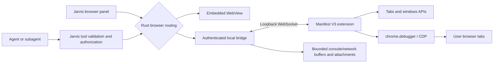

# Chromium browser extension for Jarvis

Research date: 2026-09-29. Status: **implemented locally; validation and installation details are in `CHROMIUM-EXTENSION.md`**. The original research below informed the implementation; the user selected external unpacked installation for this release, with no store publication.

## Conclusion

The requested integration is feasible. Use a Manifest V3 extension with `chrome.debugger`, the Chrome DevTools Protocol (CDP), and native tabs/windows APIs. Connect it to Jarvis through an authenticated loopback WebSocket owned by the Rust application. Keep the embedded WebView as an explicit alternative.

This can operate the user's existing authenticated browser session, interact with pages, capture screenshots, and inspect console and network activity. It does not provide unrestricted control over every browser surface: privileged pages, browser chrome, browser process lifecycle, enterprise restrictions, and parts of DevTools have separate limits.

The strongest implementation references are the local OMP browser relay and Microsoft's official Playwright extension. Codex remains the reference for admission, permission and tool contracts; the inspected Codex snapshot does not include the Desktop browser extension implementation.

## Capability coverage

| User capability | Proposed implementation | Boundary |
| --- | --- | --- |
| List, open, select, navigate and close tabs | `chrome.tabs`, explicit tab handles | A personal tab is adopted deliberately; opening a URL must not silently navigate whichever tab happens to be visible. |
| Create, focus and close browser windows | `chrome.windows` | Closing a window closes its tabs; it does not necessarily terminate the browser process. |
| Open a closed browser | Jarvis launches the selected installed Chromium application through OS process APIs | The extension cannot run while its browser is completely stopped. Browser/profile selection must be verified after launch. |
| Quit the browser application | Separate, explicit host-side operation if offered | Do not equate closing a task/session with quitting Chrome. Do not use a blanket process kill as normal cleanup. |
| Read and interact with pages | Accessibility/DOM snapshots, stable element references, CDP Input and bundled page helpers | Support frames and shadow DOM deliberately; do not rely on top-document CSS selectors alone. |
| Screenshots | `Page.captureScreenshot`, including viewport/region/full-page where supported | A page screenshot is not a screenshot of Chrome's toolbar, settings or the desktop. Size and memory limits still apply. |
| Console and JavaScript errors | `Runtime.consoleAPICalled`, `Runtime.exceptionThrown`, `Log.entryAdded` | Capture while attached. No promise of complete history before attachment or during disconnects. |
| Network inspection | `Network` events, request details and on-demand response bodies | Attach before reproducing a problem. Bodies may have been evicted or may not be available for unfinished streams. |
| WebSocket traffic | CDP Network WebSocket events | Filter and bound retained frames; do not feed every frame into the model. |
| DOM, styles and JavaScript inspection | CDP `DOM`, `CSS`, `Runtime`, supported debugger commands | Expose validated operations and capabilities, not hundreds of raw commands in every prompt. |
| Performance investigation | `Performance`, `Profiler`, `Tracing` when negotiated | Explicit capture sessions with bounded output, rather than continuous profiling. |
| Page dialogs and file inputs | `Page.handleJavaScriptDialog`, `DOM.setFileInputFiles` | OS dialogs and browser permission prompts are not ordinary page DOM. Validate upload paths through Jarvis. |
| Downloads | Extension download events and a scoped destination policy | Requires explicit capability/permission and separate handling from the current embedded browser, which denies downloads. |

CDP support is negotiated against the connected browser. The extension API provides a documented subset of CDP domains, not unrestricted browser-level CDP. In particular, do not assume the `Browser` domain is available through `chrome.debugger` [1, 7].

## Existing Jarvis architecture

The current browser is a conversation-scoped, private native WebView. It persists a small catalog of URLs, limits tabs to 12, injects DOM helpers and intercepts `console.*`. It does not represent the user's Chrome profile and has no CDP or network capture contract.

| Existing integration point | Required change |
| --- | --- |
| `src-tauri/src/agent/workflow.rs:736` — browser tool catalog | Keep catalog shaping by role and add backend capability shaping. |
| `src-tauri/src/agent/workflow.rs:1002` — browser dispatch | Preserve current tool validation/authorization; route into the selected backend. |
| `src-tauri/src/agent/browser/tools.rs:43` — translation to browser requests | Reuse validation and cancellation. The special `browser_list` path at line 50 also needs routing. |
| `src-tauri/src/agent/browser.rs:304`, `:326`, `:334` — UI commands and execution | Route both UI and agent calls before embedded catalog/WebView creation. |
| `src-tauri/src/agent/browser.rs:465` and `src-tauri/src/agent/attachments.rs:208` | Reuse attachment storage and screenshot rendering rather than inventing another image pipeline. |
| `src-tauri/src/agent/browser.rs:502` — pruning | Detach adopted external tabs; do not close them, recreate them or navigate them during restore. |
| `src-tauri/src/system.rs:196` and `src/core/system-preferences.ts:34` | Add a default browser mode and connection selection with backward-compatible defaults. |
| `src-tauri/src/backup.rs:122`, `:1193` | Export ordinary preferences; exclude pairing secrets and live session grants. Imported settings must reconnect locally. |
| `src/components/settings/SettingsDialog.tsx:59` | Add a dedicated browser configuration section. |
| `src/hooks/use-browser.ts:8`, `src/core/browser.ts:6` | Extend events/schema with backend, connection identity and capabilities. |
| `src/components/browser/BrowserPanel.tsx:16`, `src/components/files/FileWorkspace.tsx:81` | Embedded mode retains its WebView. External mode shows connection, controlled tabs, inspection results and a focus-browser action. |

Both API providers and the Claude executor already converge on the shared workflow dispatch (`agent.rs:3683`, `agent/claude_executor/bridge.rs:482`). Browser support should therefore work for both without provider-specific implementations. Parent agents and subagents share a root conversation; concurrent commands against one tab must be serialized.

The project already depends on `tokio-tungstenite` (`src-tauri/Cargo.toml:66`). A Rust WebSocket endpoint avoids adding Node, Puppeteer, another browser installation or another permanently running service to onboarding.

## Proposed architecture

### ADR 1 — Local transport

**Proposed:** one authenticated WebSocket between the extension and Jarvis Rust. Bind only to loopback; do not expose a public CDP proxy or discovery endpoint. Use a versioned JSON protocol with validated messages, request IDs, cancellation, deadlines and explicit connection state.

| Alternative | Benefits | Cost / decision |
| --- | --- | --- |
| Authenticated loopback WebSocket | Matches OMP and Playwright patterns; reuses a Rust dependency; works without host-manifest registration | Requires explicit pairing, origin validation, reconnect and port-conflict handling. Recommended. |
| Native messaging | Browser authenticates extension identity through an `allowed_origins` manifest; no listening TCP port | Adds a browser-launched helper and OS/browser-specific registration, including update/uninstall handling. Host-to-browser messages are limited to 1 MB, reverse direction to 64 MiB. Keep as an alternative if a concrete distribution/policy requirement warrants it [2]. |
| Official Playwright MCP + extension | Fast way to experiment with the interaction model; mature existing integration | Adds an external runtime and does not by itself deliver Jarvis-native settings, ownership, lifecycle and output handling. Useful reference or optional experiment, not the recommended core dependency. |
| Chrome DevTools MCP auto-connect | Official way to attach to existing Chrome without an extension in supported recent Chrome versions | Requires remote-debugging setup/Chrome authorization and has different profile-selection semantics. Does not replace the requested extension UX [10]. |
| Remote debugging port on the personal profile | Familiar CDP endpoint | Avoid as the normal installation path; unnecessary browser flags and profile restrictions, including changes in Chrome 136+, make this inferior to the extension. |

The local OMP server must **not** be treated as a ready security boundary: its token is optional and protects `/ext`, while `/cdp` admits native local clients without that token and `/json/list` is unauthenticated. Jarvis should authenticate every control surface, or simply omit those proxy/discovery surfaces [9]. Port locality and an Origin check alone do not authenticate a local client.

Pairing should require a one-time explicit connection from the extension to the running Jarvis instance. Validate a high-entropy credential and the expected extension origin; support revocation. Keep credentials out of URLs, logs, model context and preference backups. Origin validation complements authentication; it does not replace it. A port collision must produce a readable status or guided alternate endpoint, never adoption of an unrelated server.

### ADR 2 — Shared tools and efficient context

**Proposed:** retain the existing high-level `browser_*` tools and add capabilities such as network inspection and windows through the same Rust dispatch. A small backend enum/match is sufficient; do not introduce a general plugin framework for two backends.

Prefer semantic page observations and stable element references, then coordinate-based interaction when necessary. Bind references to the current document/frame generation so a navigation cannot make an old element ID target a different control. CDP supports related iframe sessions, including flat sessions since Chrome 125 [1].

Keep raw console/network data in bounded local buffers. Return summaries, filters, counts and pagination first; retrieve response bodies, object properties, traces and screenshots only when useful. Apply attachment limits and reuse current screenshot cards. Redact credentials from routine diagnostics; opening an authenticated page does not require exporting its cookies into the model context.

Do not make an Internet connection check part of bridge readiness: browser control is local and should continue to work for localhost/offline pages. The bridge must not block application bootstrap. An unavailable external browser must return a recoverable error, not silently switch to a different browser/session.

### ADR 3 — Ownership and recovery

**Proposed:** identify a connection by browser/profile instance and a fresh connection epoch. Identify tabs within that instance; do not persist a bare `tabId` and assume it survives a browser restart. A friendly profile label can be user-supplied: the extension cannot be assumed to reveal the actual profile directory/name.

One conversation owns the command queue for a controlled tab. Other chats can use different tabs concurrently. Subagents in the same conversation share that queue. Existing personal tabs are adopted, not owned for cleanup; only deliberately created task tabs are eligible for normal task-tab cleanup. Opening a new URL should create a task tab unless an existing target was explicitly selected.

Pin backend and connection to the active browser session. Changing the default preference must not redirect an in-flight operation to another profile. Preserve task results and the user's current intent across reconnects.

Manifest V3 workers can be suspended. Active debugger sessions keep workers alive in Chrome 118+, and WebSocket message traffic extends their lifetime in Chrome 116+, but unexpected termination still requires handling [3]. Use heartbeats, bounded reconnect backoff and inventory reconciliation; never an endlessly loading dialog.

Each request has an ID and result state. After a disconnect:

- Inventory and other safe observations can be repeated.
- A response lost after dispatch does not prove that the action failed. Return **outcome unknown**, observe the page and use a same-session result cache if available.
- Do not automatically repeat a submit, purchase, comment, destructive click or upload whose outcome is uncertain.
- Invalidated element/frame handles require a fresh snapshot.
- Browser updates, extension reloads, DevTools attachment and user tab closure are ordinary recoverable lifecycle events.

Recovery must be observable in the chat, with finite transport waits and useful next actions. Do not impose a new arbitrary total duration limit on the agent's task.

## Settings and onboarding experience

Add **Configurações → Navegador** with two explicit modes:

- **Navegador embutido** — preserve current behavior and existing-installation default.
- **Chrome / Chromium com extensão** — show detected/connected browser instances, profile label, connection state, extension version and capabilities.

The external flow is: **Prepare extension → Load unpacked → Connect to Jarvis**. Per the user's distribution decision, Jarvis supplies a stable local folder and guides the user through developer mode and **Load unpacked**. Chrome Web Store publication is deferred; no store URL is required. After a Jarvis update, prepare the files again and reload the extension in the browser.

Show **Abrir navegador**, **Reconectar**, **Desconectar** and actionable installation/compatibility errors where relevant. The extension should indicate when Jarvis is connected and actively controlling tabs, and offer an obvious pause/disconnect action. Tab groups can distinguish task-owned tabs without moving pinned tabs or replacing the user's groups.

Connection authorization should persist until revoked. Once connected and authorized, routine clicks and navigation should follow existing Jarvis autonomy settings, rather than ask for approval on every operation. Initial Chrome consent and enterprise policy are browser boundaries that Jarvis cannot silently bypass.

The extension and desktop application have independent update channels. Negotiate protocol versions and capabilities, keep stable extension identity, and explain incompatible combinations rather than leaving the connection spinner running. Chrome/Edge/Brave are sensible first validation targets; other Chromium derivatives remain compatibility candidates until tested.

## Limits that must remain explicit

1. **Not literally all of DevTools.** `chrome.debugger` exposes selected CDP domains. Provide the useful debugging operations through those domains rather than promise an unrestricted clone of the DevTools UI [1].
2. **DevTools can interrupt attachment.** Chrome documents debugger detachment when DevTools opens for the inspected tab. Detect it, release the queue cleanly and reconnect when available; do not repeatedly fight the user's DevTools session [1].
3. **Privileged pages are restricted.** Internal browser pages, the Web Store and other extensions cannot be treated like ordinary web pages. File URL/incognito access can require separate browser-granted access; enterprise policies may prohibit debugger attachment entirely.
4. **The Chrome debugging banner is expected.** The debugger permission carries broad browser warnings. Do not promise to hide browser-controlled notices or approve permissions silently [5, 9].
5. **Observability is not retroactive.** Network/console capture starts with instrumentation. Missing requests or response bodies must be reported honestly. The `chrome.devtools.network` alternative also depends on a DevTools page and can miss earlier requests, so it is not the core transport [6].
6. **Distribution is a separate deliverable.** Normal Chrome installation on Windows/macOS relies on the Chrome Web Store outside managed enterprise installation paths. Store review, stable ID and independent updates must be accounted for; store publication is not guaranteed by a passing local build [4].
7. **Bundle extension code.** Manifest V3 restricts remotely hosted executable code. Keep extension logic and ordinary interaction helpers bundled; review any proposed arbitrary evaluation capability against store policies instead of assuming all dynamic execution is acceptable [8].

## Validation required before shipping

This research establishes feasibility, not runtime correctness. A focused vertical slice should prove pairing, existing-tab adoption, typed interaction, screenshot, console and network capture through the actual extension and Jarvis transport on macOS, Windows and Linux.

Behavioral coverage should include two profiles, two simultaneous chats, iframe navigation, stale element references, large screenshots, bounded network buffers, offline/online transitions, extension worker restart, Jarvis restart, browser restart and update, DevTools opening, tab closure, revocation, port conflicts, incompatible versions and imported preferences without credentials. A deliberately lost response after a submit must not cause a second submit. Deleting a chat must leave adopted personal tabs intact.

Unit tests should cover protocol validation, authenticated admission, routing for both API and Claude executors, tab ownership and reconnection states. Browser E2E tests must use real Chromium with the extension loaded and verify observable page effects. Native-browser launch/profile behavior and store installation require separate platform evidence; unit tests and an unpacked local smoke do not prove those paths.

The next implementation should progress through the real extension/bridge slice, shared Rust routing and ownership, page/diagnostic capabilities, then settings/distribution and cross-platform validation. Detailed implementation work should be tracked in Beads after this architecture is selected, not as a parallel Markdown task list.

## Sources and reference decisions

Primary documentation was retrieved during this research. Local code references are snapshots and were not modified.

1. [Chrome debugger API: permissions, supported domains, frame sessions and detachment](https://developer.chrome.com/docs/extensions/reference/api/debugger).
2. [Chrome native messaging: host registration, framing and size limits](https://developer.chrome.com/docs/extensions/develop/concepts/native-messaging).
3. [Extension service worker lifecycle](https://developer.chrome.com/docs/extensions/develop/concepts/service-workers/lifecycle).
4. [Extension installation and distribution](https://developer.chrome.com/docs/extensions/how-to/distribute/install-extensions).
5. [Chrome permissions and warning text](https://developer.chrome.com/docs/extensions/reference/permissions-list); [Tabs API](https://developer.chrome.com/docs/extensions/reference/api/tabs); [Windows API](https://developer.chrome.com/docs/extensions/reference/api/windows).
6. [DevTools Network API and historical capture limitations](https://developer.chrome.com/docs/extensions/reference/api/devtools/network).
7. [CDP browser protocol definitions](https://github.com/ChromeDevTools/devtools-protocol/blob/master/json/browser_protocol.json) and [JavaScript protocol definitions](https://github.com/ChromeDevTools/devtools-protocol/blob/master/json/js_protocol.json). Tip-of-tree definitions require runtime capability negotiation.
8. [Manifest V3 remotely hosted code policy](https://developer.chrome.com/docs/extensions/develop/migrate/remote-hosted-code).
9. OMP local `docs/omp/packages/browser-relay/README.md`, `extension/background.ts`, and `coding-agent/src/tools/browser/relay/`; [server authentication boundary](https://github.com/can1357/oh-my-pi/blob/5964a0f7649275bcde818f20073193fd032451f2/packages/coding-agent/src/tools/browser/relay/server.ts#L57-L108), [worker reconnect](https://github.com/can1357/oh-my-pi/blob/5964a0f7649275bcde818f20073193fd032451f2/packages/browser-relay/extension/background.ts#L213-L296). Reuse concepts, not source text or the permissive authentication defaults.
10. [Official Chrome DevTools MCP existing-browser connection](https://github.com/ChromeDevTools/chrome-devtools-mcp/blob/96facec9110467efdfbb3dd07c75d21fe2627cfd/docs/advanced-usage.md#L43-L99).
11. [Official Playwright extension: installation, tokens, profiles and client groups](https://github.com/microsoft/playwright/blob/5f47e4fb551fa486aec567b05ee11dc7ea6bbeda/packages/extension/README.md); [CDP relay](https://github.com/microsoft/playwright/blob/5f47e4fb551fa486aec567b05ee11dc7ea6bbeda/packages/playwright-core/src/tools/mcp/cdpRelay.ts#L95-L120). Reference session ownership and explicit pairing without adopting another runtime as Jarvis core.
12. Codex local `docs/codex/codex-rs/config/src/browser_use.rs:7`, `browser_computer_use_requirements.rs:14`, `browser_use_tests.rs:7`, and `core/src/tools/orchestrator.rs:128`: separate browser access/capabilities from common tool admission. These files do not establish that Codex Desktop's extension source is available.
13. OpenCode local `docs/opencode/packages/opencode/src/tool/tool.ts:112` and `tool/registry.ts:136`: validate tool arguments and bound results through common infrastructure. `src/mcp/browser.ts` opens OAuth URLs; it is not a browser automation backend.
