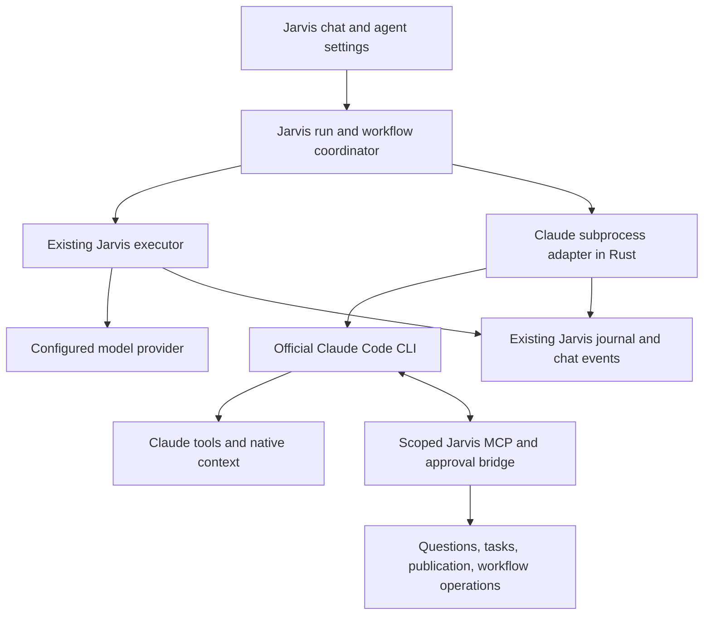

# Claude as a selectable Jarvis executor

Research date: 2026-09-25. Jarvis baseline: `b1d34c3` (1.5.4).
Research tracking: `jarvis-fs3f`.

## Recommendation

Add **Claude as an execution backend for a Jarvis agent**, initially by running the official, unmodified Claude Code CLI from Rust. Keep the agent's role, instructions, project, conversation, and workflow assignment in Jarvis. Let Claude own its inference/tool loop and upstream conversation context.

The intended selection is:

```text
Agent: Designer
Execute with: Jarvis | Claude

Jarvis selected: provider account → model → supported effort
Claude selected: local Claude connection → model → supported effort
```

This also applies to Github, user-created agents, and workflow assignments. Selecting Claude should not replace the Designer role with a generic chat or require a fake Anthropic provider account in Jarvis.

Start with one native Claude adapter and a small execution boundary. Do not implement a general agent marketplace or an ACP framework first. ACP remains a useful subsequent transport for additional executors; it is not required for this integration and does not determine subscription eligibility.

The research below informed the implementation described in the delivery section. Reference repositories and native Claude credentials remain unchanged; live qualification so far covers metadata and initialization, not model inference.

## Implementation delivery

The executor selector is now separate from provider accounts in the composer, native agent profiles, custom agents and workflows. Existing records default to Jarvis. Claude selections preserve model/effort through workflow dispatch, publication workers, retry, queues, assisted authoring and settings backup/import. The onboarding can use an authenticated Claude installation without requiring a second API provider.

`src-tauri/src/claude` launches the official CLI with structured JSON streams. Authentication remains with that CLI. The status dialog provides installation/login guidance and refreshes its reported model catalog. Initialization-only discovery was qualified against **Claude Code 2.1.250**, including SDK MCP callbacks and live model effort capabilities; no user prompt or inference was sent during that check.

`src-tauri/src/agent/claude_executor` projects native messages into the existing revisioned journal. Claude owns inference, session context and automatic compaction. Jarvis exposes its existing tools over a scoped SDK MCP connection, retaining role restrictions, repository scope, tasks, questions, publication review, Core hooks and command ownership. Built-in Claude tools and external Claude hooks are disabled for these managed sessions so there is only one tool authorization path. This is a deliberate integration boundary, not an unrestricted embedded Claude terminal. ACP and a general executor plugin framework remain outside this implementation.

Native session identifiers support continuation without replaying the full transcript. Switching from another executor uses a bounded handoff of user directions, summary and confirmed receipts. User image blocks are scoped to the conversation and transient. Tool receipts precede auxiliary indexing, duplicate callbacks retain structured failures, and uncertain effects are not silently repeated. Child results never complete the parent. Cancellation stops only the managed process group; pipe writes have a finite deadline.

Deterministic tests cover transport initialization, control correlation/cancellation, process cleanup, streamed and completed message reconciliation, tasks/questions, bounded handoff, images, settings compatibility, workflow models and backups. Full application gates and live workflow validation must be reported separately. A real Claude task, subscription entitlement, and native Windows/Linux GUI execution cannot be inferred from metadata or fixture tests.

## What OpenDesign actually does

The local OpenDesign checkout supports the requested user experience, but its Claude integration is **not ACP**.

| Concern | Observed implementation | Jarvis implication |
| --- | --- | --- |
| Executor | `claudeAgentDef` identifies `Claude Code` and launches the `claude` executable. | An external process is a separate executor, not another HTTP model provider. |
| Transport | `-p --input-format stream-json --output-format stream-json --verbose`; partial events are capability-gated. | Structured events can drive the existing chat without rendering a terminal transcript. |
| Model | The selected value becomes `--model`. Discovery falls back to aliases and explicit IDs; local proxy routes can supplement it. | The selector is not proof that every displayed model is available to the account. Do not copy its fixed catalog as authoritative. |
| Authentication | Version/help discovery and `claude auth status`; missing authentication directs the user to the CLI's own login. | Detect and guide native login rather than collecting Claude subscription tokens. |
| Continuation | A new session gets `--session-id`; later turns use `--resume` with the durable CLI session ID. | Preserve upstream state instead of rebuilding it from rendered chat text on every turn. |
| Mid-run input | Stdin remains open for additional JSON messages. | An input channel is feasible; exact queued-message versus steering behavior still needs verification. |
| Tools | Claude performs its own calls. OpenDesign interprets assistant/tool/result events. | Jarvis must not execute those tool calls a second time. |
| Permissions | The Claude definition unconditionally appends `--permission-mode bypassPermissions`. | This does not preserve Jarvis approval semantics and must not become an unconditional default. |
| MCP | The definition selects injection into a managed project's `.mcp.json`. | Jarvis should supply session configuration without overwriting a user's existing project MCP file. |
| UI | `InlineModelSwitcher` handles agent changes separately from model changes. | Reuse the conceptual separation, not OpenDesign's component implementation. |

Local evidence:

- [`defs/claude.ts`](open-design/apps/daemon/src/runtimes/defs/claude.ts), lines 20–50, 58–132: launch, models, authentication, continuation, permissions, MCP.
- [`invocation.ts`](open-design/apps/daemon/src/runtimes/invocation.ts), lines 9–46: metadata probes use a neutral working directory and bounded process execution.
- [`auth.ts`](open-design/apps/daemon/src/runtimes/auth.ts), lines 59–60, 199–231, 389 onward: login guidance and authentication classification.
- [`InlineModelSwitcher.tsx`](open-design/apps/web/src/components/InlineModelSwitcher.tsx), around lines 501–551 and 754–771: separate executor/model callbacks.
- [`new-agent-runtime-acp.md`](open-design/docs/new-agent-runtime-acp.md), lines 7–89: ACP is the recommended transport for new runtimes, while existing native adapters remain distinct.

OpenDesign's stream tests are especially relevant to Jarvis's previous incidents. A subagent's `end_turn` must not finish the main turn. A recoverable child error must not automatically fail a successful parent. Process exit and the main result envelope must be reconciled, and retries must not leave descendants running.

- [`claude-stream.ts`](open-design/apps/daemon/src/runtimes/claude-stream.ts), lines 392–568, distinguishes child events, parent completion, and error results.
- [`claude-sidechain-turn-end-false-success.test.ts`](open-design/apps/daemon/tests/claude-sidechain-turn-end-false-success.test.ts), line 84, reproduces a child finishing before a parent crashes.
- [`retry-orphan-process-group.test.ts`](open-design/apps/daemon/tests/retry-orphan-process-group.test.ts), line 61, checks descendant cleanup between attempts.

These implementations were inspected, not executed or copied.

## CLI, SDK, and ACP are different choices

| Approach | Who runs the agent loop? | Integration | Fit for the stated goal |
| --- | --- | --- | --- |
| Anthropic API in the current Jarvis harness | Jarvis | Existing provider/tool machinery | Useful API access, but it is not the Claude Code agent and does not include subscription usage. |
| Official Claude Code CLI | Claude | Native subprocess, structured input/output, native session IDs, permission host | Recommended starting point for using the installed agent and its own sign-in methods. Fits Rust without requiring a new Node worker. |
| Claude Agent SDK | Claude | Python/TypeScript library with typed callbacks and lifecycle methods | Rich integration API. Published developer guidance specifies API/cloud authentication unless separately approved. Do not assume subscription eligibility merely because the SDK runs a Claude binary. |
| Claude ACP adapter | Claude through the Agent SDK | ACP client plus the third-party adapter | Standardized UI/session integration. Adds an adapter and runtime dependencies; does not grant different billing rights. |

The current ACP adapter is `@agentclientprotocol/claude-agent-acp`, maintained in the Agent Client Protocol ecosystem and originally by Zed. Its inspected package version is 0.81.2, with Node >=22, ACP SDK 1.5.0, and Claude Agent SDK 0.3.280. These are research observations, not proposed dependency pins.

Its advertised capabilities include tool permissions, images, edit review, client MCP servers, TODO lists, nested subagent transcripts, and terminals. Some features, including richer failure and permission presentation, use extensions. A generic ACP client cannot assume every extension exists on every agent.

Zed's current documentation makes the same product distinction: external agents own their authentication, models, and native settings; the editor's own provider settings, profiles, and skills do not automatically become the external agent's configuration.

Sources: [ACP introduction](https://agentclientprotocol.com/overview/introduction), [Claude ACP adapter](https://github.com/agentclientprotocol/claude-agent-acp), [Zed external agents](https://zed.dev/docs/ai/external-agents), [Claude SDK overview](https://code.claude.com/docs/en/agent-sdk).

## Authentication and subscription boundaries

The current Anthropic documentation explicitly describes running the **unmodified Claude Code binary** in another product, with users authenticating through Anthropic's own flow and being billed under their own agreement. It also says the host must not remove or restrict the binary's authentication methods, intermediate credentials or usage, or misrepresent the product as Anthropic's.

The SDK documentation separately directs third-party developers to API authentication unless approved. The account support article allows Anthropic, at its discretion, to permit certain third-party tools with paid usage credits. That is not a blanket Pro/Max entitlement for arbitrary SDK/ACP applications.

For Jarvis:

- Offer detection, installation guidance, an embedded terminal for the CLI's own login, and a refresh of authentication status.
- Do not extract tokens from the OS keychain, copy Claude OAuth into Jarvis providers, or impersonate a native client through custom HTTP requests.
- Preserve the binary's supported authentication choices. Surface the effective account/provider mode when available, because API environment configuration can select paid API usage instead of the subscription.
- Do not silently switch billing modes or promise that every model is covered by a flat subscription. Model and plan restrictions remain upstream decisions.
- Keep subscription limits, API charges, token counts, and runtime-reported cost estimates distinct. A token-cost estimate is not necessarily an actual charge to a subscriber.

Sources checked: [Claude Code integration terms](https://code.claude.com/docs/en/legal-and-compliance#can-customers-offer-claude-code-in-their-products), [account authentication](https://support.claude.com/en/articles/13189465-log-in-to-your-claude-account), [subscription and Claude Code](https://support.claude.com/en/articles/11145838-use-claude-code-with-your-pro-or-max-plan), [usage credits](https://support.claude.com/en/articles/12429409-manage-usage-credits-for-paid-claude-plans).

## Proposed Jarvis boundary



### Selection and persistence

Today `TurnOptions` requires `account`, `model`, and `reasoning` in [`agent.rs`](../src-tauri/src/agent.rs), line 165. [`ModelChoice`](../src-tauri/src/agent/workflow/settings.rs), line 6, repeats that shape, and [`AgentDefinition`](../src-tauri/src/agent/workflow/catalog.rs), line 39, stores it as the agent's optional model configuration.

Introduce an explicit execution choice that distinguishes native provider execution from Claude execution. Normalize existing records to the native choice so old chats, saved agents, and workflows keep their behavior. Do not overload `account` with a fabricated Claude provider ID.

The effective choice must survive queued messages, retry, restart, subagent dispatch, profile overrides, custom workflow nodes, authoring tools, backup/import, and provider-reference checks. Older records should not be rewritten simply to display the selector.

Existing UI integration points include `ModelPicker`, `ChatComposer`, `AgentSettings`, `CustomAgentEditor`, `WorkflowSettings`, and `WorkflowFields`. Keep the visible workflow and role selectors; the executor is a separate property of the selected agent/profile.

### One agent loop per execution

The current run path resolves an inference credential and constructs `provider::TurnSession` at [`agent.rs`](../src-tauri/src/agent.rs), lines 2398–2435. The backend branch must happen before that native-provider setup.

Keep common run ownership, durable state, user input, cancellation, telemetry, and rendering around the branch. The Claude branch must not enter Jarvis's HTTP provider/tool loop or its compaction loop. Conversely, Claude tool events are observations of work Claude has already requested/executed; they are not new instructions for the Jarvis dispatcher to execute again.

The existing revisioned event and journal machinery should receive normalized external events. Do not create a second renderer-side transcript store: that would risk reintroducing the disappearing-message and delayed-sidebar bugs.

### Session lifecycle and recovery

Persist the Jarvis conversation/turn IDs, executor identity and version, native Claude session ID, and event/message IDs. Resume the native session for later turns. Native transcript state belongs to Claude; Jarvis retains the user-visible history and its own workflow state.

Switching execution backend must be an explicit transition. Use an auditable handoff summary of the user's current intent, confirmed results, and remaining work when native state cannot be reused. Do not replay old side-effecting calls or send the entire rendered transcript as a new task.

Treat partial text, assistant messages, tool calls/results, child events, retries, permission waits, and the final main result as distinct events. Deduplicate stream acknowledgments and replay on reconnect. Completion of a child is not completion of the parent. A crash after an uncertain mutation is resumable/reconcilable work, not permission to automatically rerun it.

Cancellation must settle pending approvals and close the execution's owned process tree. Track macOS/Linux process groups and Windows process ownership using existing platform patterns. Avoid adding a wall-clock kill policy that treats a long but progressing implementation as stalled.

### Model discovery

Prefer the models, resolved IDs, and effort capabilities reported by Claude itself. Official SDK documentation exposes `supportedModels()` and an initialization response containing `models: ModelInfo[]`; each entry can declare `resolvedModel`, `supportedEffortLevels`, and other capabilities.

The official Python SDK source shows the underlying initialization control exchange over the CLI transport. A Rust adapter can be evaluated against that exchange, but the standalone wire compatibility is a version-sensitive integration point, not ACP. Qualify it with fixtures and a supported CLI version range before relying on it.

If discovery is unavailable, offer the CLI default and documented aliases as explicitly identified fallback choices. A fallback alias is not confirmation of account entitlement. Do not silently replace a user's choice or reuse the Anthropic API account's model catalog for the subscription CLI.

Refreshing the model list should be a metadata operation, without an inference prompt. Cache by runtime version and effective account/provider configuration, and show the model actually selected by the runtime after startup.

Sources: [model configuration](https://code.claude.com/docs/en/model-config), [SDK types](https://code.claude.com/docs/en/agent-sdk/typescript#modelinfo), [SDK initialization](https://code.claude.com/docs/en/agent-sdk/typescript#sdkcontrolinitializeresponse), [official Python control implementation](https://github.com/anthropics/claude-agent-sdk-python/blob/main/src/claude_agent_sdk/_internal/query.py).

### Approvals, questions, and Jarvis tools

Claude's CLI documents `--permission-prompt-tool` for an MCP tool that handles permission requests. The SDK also documents `canUseTool` and structured `AskUserQuestion` handling. The first implementation should qualify the public MCP permission host and the native streaming control route against the same Jarvis approval behavior before choosing the smallest complete route.

The current [`mcp/runtime.rs`](../src-tauri/src/mcp/runtime.rs) provides clients for Jarvis to call MCP servers. It is not already a server exposing Jarvis's private agent handlers to another CLI. Add a small scoped bridge that reuses those handlers rather than a second implementation of publication, questions, and tasks.

Expose only the features required by the active role, such as `ask_user`, `update_tasks`, workflow Beads operations, `validation_publish`, and approved catalog/authoring tools. Keep internal workflow Beads separate from the project's independent Beads checkout. Bind bridge calls to the project, conversation, current turn, and role, including child runs.

Each permission decision needs a unique request ID and the exact action under review. Cancellation or a late response cannot approve a later action. Preserve previously granted scope and the user's explicit autonomy; do not turn every ordinary action into another confirmation. Approval with a note must return that note for reconsideration before publication, matching the existing Jarvis contract.

Native Bash/Edit calls do not pass through Jarvis's usual tool dispatcher. Publication restrictions, role restrictions, and execution grants therefore need an enforceable native permission/hook mapping. An instruction telling Claude to use a publication tool is insufficient on its own. Permission callbacks are also insufficient for rules that must inspect every call, because auto-approved calls bypass them; the documented `PreToolUse` hook is the relevant integration point for those rules.

Supply MCP configuration through the CLI's per-run configuration mechanisms. Do not overwrite `.mcp.json`, `.claude`, or user-global settings. Preserve the requested MCP intent and avoid starting duplicate connections for servers already managed by Jarvis where a scoped proxy can reuse them.

Sources: [CLI flags](https://code.claude.com/docs/en/cli-reference), [interactive input](https://code.claude.com/docs/en/agent-sdk/user-input), [programmatic execution](https://code.claude.com/docs/en/headless).

### Instructions, Core resources, and workflows

Append the selected Jarvis role, response language, repository map, applicable AGENTS instructions, and task contract to Claude's native instructions. Preserve its native system prompt. `--append-system-prompt-file` is a documented mechanism; session-resume behavior must also preserve the intended instructions. Do not assume Claude automatically reads Jarvis's AGENTS hierarchy or custom skills catalog.

Core resources are not automatically integrated merely because Claude can execute shell commands or MCP calls. Reuse applicable Jarvis services through the bridge/hooks: design context, task updates, publication approval, and diagnostics after actual edits. Avoid advertising two competing file/terminal tools without a concrete reason. Jarvis's automatic LSP and context-result processing currently run in its own harness, so their external-executor behavior needs explicit coverage.

For mixed workflows, keep Jarvis as the owner of workflow phases, dependency scheduling, Beads state, validation, and each dispatched node. Run Claude inside the assigned node with the same task contract and a distinct native session. Claude's own optional children are subordinate runtime activity, not automatically new Jarvis workflow phases.

Qualify standalone execution and a Claude worker in a mixed workflow before enabling an external planner. The latter also needs the Jarvis dispatch, wait, task-comment, and finish contracts exposed and tested. This is an implementation sequence, not a proposal to permanently limit user-created workflows.

## What the other reference projects contribute

| Reference | Evidence | Reusable decision |
| --- | --- | --- |
| Codex | `app-server-protocol/src/protocol/v2/thread.rs:62`, `turn.rs:166`, `item.rs:1534` | Separate thread configuration, turn input, workspace roots, and correlated approval requests. Keep the application outside the agent's internal loop. Codex's native app-server protocol is not ACP. |
| OpenCode | `src/acp/agent.ts`, `config-option.ts:31`, `permission.ts:21` | ACP is an adapter around existing services; expose dynamic model/effort options and explicit permission outcomes instead of duplicating the underlying agent. |
| OMP | `src/modes/acp/acp-agent.ts:629`, `688`, `700`, `1735` | Negotiate authentication/session capabilities, keep authentication owned by the agent, replay durable sessions, and publish model choices from the live registry. |
| OpenDesign | Claude definition, stream adapter, UI, and regression tests above | Launch the actual CLI, keep upstream sessions, distinguish parent/child termination, and clean up owned subprocesses. |

ACP's current protocol documents model configuration, permissions, cancellation, session loading/resumption, and client-provided MCP servers. Support is negotiated; a client must not assume every external agent supports every operation. If Jarvis later adds ACP, map those events into the same execution boundary and journal rather than replacing the native Claude integration with a second chat implementation.

Protocol references: [configuration options](https://agentclientprotocol.com/protocol/v1/session-config-options), [session setup](https://agentclientprotocol.com/protocol/v1/session-setup), [tool permissions](https://agentclientprotocol.com/protocol/v1/tool-calls), [prompt and cancellation lifecycle](https://agentclientprotocol.com/protocol/v1/prompt-turn).

## Implementation sequence and acceptance evidence

1. **Native integration contract:** isolated subprocess fixture plus optional live qualification of initialization/model metadata, streaming, MCP permission callback, questions, resume, cancellation, and process-tree cleanup. Establish the compatible CLI versions and choose the permission route based on this evidence.
2. **Execution choice and standalone chat:** backward-compatible settings, discovery/login guidance, role instructions, native session IDs, existing journal/event projection, and dynamic models. Native Jarvis execution remains the default for old configurations.
3. **Jarvis feature bridge:** tasks and questions update during execution; publication displays the existing review drawer; approval notes revise the proposal; role permissions and explicit autonomy behave consistently; filesystem changes refresh the existing inspector.
4. **Mixed workflows and persistence:** native planner with Claude worker, then Claude planner after its orchestration contract passes; cover queued input, restart, retry, custom authoring, and backup/import.
5. **Optional ACP expansion:** add an ACP transport only when another requested executor needs it, using the already-proven execution/event contract.

Behavioral qualification must include:

- A user message remains visible from send through acknowledgments, restart, and resume; partial/final text is not duplicated.
- Tasks and child activity update before completion, and completing a child does not finish the main run.
- An approved native tool executes once; an edited approval is reconsidered; cancellation cannot grant a later request.
- A runtime crash after a write preserves the result and offers continuation without replaying the mutation.
- Commit/PR/merge approval, existing PR recovery, and explicit user autonomy retain their current behavior.
- Multiple configured repositories remain accessible within the intended project scope.
- A changed/missing model is reported accurately; aliases and account entitlements are not fabricated.
- A resumed session receives the correct current role/task instructions and MCP intent without a full-history reseed.
- Runtime-owned and user-owned terminals remain distinguishable, and cancelling a run does not kill an unrelated user terminal.
- Legacy native profiles, custom flows, authoring requests, backup/import, and provider-reference checks remain compatible.
- Windows executable paths/arguments and cancellation, Linux process ownership, and macOS login/PATH behavior pass native platform checks.

Use deterministic fake-CLI/MCP fixtures for the failure cases; run real-provider qualification only with an explicitly selected test account and isolated project. Compare total elapsed time, time to first visible message, duplicate events, retries, token/cost reporting, and successful completion. No speed or reliability improvement is claimed solely from adopting Claude.

## Research evidence boundaries

| Item | Observed |
| --- | --- |
| Local Claude executable | `/Users/enesolucoes/.local/bin/claude`, version `2.1.250`. |
| Local CLI metadata checks | `--version`, `--help`, and `-p --help` succeeded. Help includes structured input/output, resume, model, effort, MCP configuration, appended instructions, permission modes, and partial messages. |
| Live authentication/model catalog | Not invoked. No tokens or credentials were inspected. |
| Live tool/permission/resume behavior | Not exercised. Documentation/source support is not end-to-end validation. |
| Compatibility drift | Current online docs describe some flags newer than the installed CLI, such as `--permission-prompts` requiring 2.1.259. Discovery and version qualification are required. |
| Jarvis code changes | None in this research; documentation only. No build or application tests needed for this document. |
| Reference trees | Inspected read-only; all four reference worktrees remained clean. |

Reference snapshots: OpenDesign `3d0d15fc5` / package 0.21.1; Codex `a592c38c16`; OpenCode `830d5eb535`; OMP `5964a0f764`. Online documents and adapter metadata were read on the research date and can evolve independently of these snapshots.

## Implemented integration

The implementation tracked by `jarvis-zih4` adds an explicit **Jarvis / Claude** executor selection in the composer, agent profiles, custom agents, workflow nodes, and publication worker configuration. Existing selections default to Jarvis. Claude models and effort levels come from the installed CLI; its status dialog provides installation/login guidance and an explicit refresh. Claude-only onboarding and portable configuration backups preserve this choice without inventing a Jarvis provider account or exporting Claude credentials.

Rust launches the official, unmodified Claude Code CLI using structured stdin/stdout. Claude owns inference and native context management; Jarvis retains tool execution, workflow coordination, execution grants, approval drawers, questions, and journal persistence. The CLI receives the selected role, project context, and a scoped SDK MCP bridge. Native tools are disabled and all CLI hooks are disabled for these managed runs, so effects cannot bypass Jarvis tool admission through a native tool or a user/project hook. No project MCP configuration is overwritten.

The bridge reuses the existing handlers for files, patches, terminals, task updates, authoring, publication, Core resources, and external MCPs. Native vision accepts scoped attachments without requiring a separate API account. Session IDs and confirmed tool receipts remain in the existing journal; executor switches receive bounded context, and cancellations stop only owned subprocesses. Streaming projection supports partial events and split assistant envelopes without duplicating messages or treating a child result as parent completion. Token and duration metrics use reported native message usage rather than fabricated provider retries.

Qualification performed during implementation included metadata-only initialization against the installed Claude Code **2.1.250**, dynamic model/effort discovery, and SDK MCP initialization. It did not submit a task for inference. Deterministic subprocess fixtures cover structured controls, malformed output, cancellation, blocked stdin, and process cleanup; adapter tests cover streaming, task/question updates, handoff, images, replay, and configuration compatibility.

Final automated validation: `bun run check` passed lint, TypeScript, 720 frontend tests (1 skipped), production build, and generated IPC compatibility. `cargo fmt --check`, `cargo clippy --all-targets --offline -- -D warnings`, and `cargo test --offline --quiet` passed; the Rust suite reported 908 passed and 21 opt-in tests ignored. The initial concurrent frontend/Rust run timed out five UI tests; the frontend gate passed when rerun without competing Rust compilation, without increasing timeouts. The final cancellation/replay changes were covered by the subsequent Rust gates. Reference source trees remained unchanged.

A real task using the user's Claude account and native Windows/Linux application checks remain separate acceptance checks. Automated tests and a metadata handshake do not establish end-to-end provider reliability or cross-platform GUI behavior. No performance improvement is claimed from selecting Claude alone.
