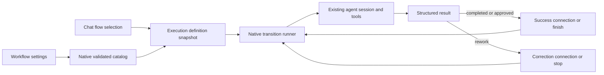

# Custom workflows and agents

See [Workflow polish](WORKFLOW-POLISH.md) for drag stability, custom Inspector cards, configurable icons/colors and the latest delivery.

## Architecture decision

The four Jarvis workflows and their role contracts remain compiled, immutable
definitions. User definitions live in a separate, revisioned native catalog at
`~/.jarvis/workflow-catalog.json`; custom identifiers cannot replace built-ins.
Existing per-role provider/model bindings remain execution preferences, separate
from immutable instructions and topology.

The Metis reference was studied in `docs/metis/docs/agents.md` and
`docs/metis/src/core/agent-definition.ts`: agent definitions combine instructions,
model overrides and constrained capabilities. Jarvis adopts those concepts, but
does not adopt Metis's name-based override precedence for built-in definitions.

The user requested a draggable canvas. React Flow manages the canvas geometry and
connections; shadcn components provide node cards, forms, dialogs and controls.
See the official [handle documentation](https://reactflow.dev/learn/customization/handles).

## Execution semantics

Each block references a custom agent and optional step-specific instructions.
The entry block is explicit. One agent runs at a time. A success edge routes
completed/approved results; a correction edge routes rework. Missing success
edges finish the flow. Missing correction edges, blocked results and errors stop
with an actionable explanation. Every graph must be reachable from its entry,
and its success paths must terminate. Correction loops are bounded by a
user-configured execution limit. The canvas represents these semantics directly;
it does not imply parallel branches.

The run freezes agent definitions and graph before its first worker starts.
Edits or deletions affect subsequent runs only. Each step uses the existing
native worker lifecycle, cancellation, approval/question routing and durable
transcripts. No model is allowed to invent extra edges or dispatch unconfigured
agents. A stopped/interrupted workflow is never automatically replayed, because
previous steps may have changed files or executed commands.

Agents can inherit the composer model or select a provider/model/reasoning
override. Capabilities are explicit: read-only, file editing, or commands.
Capabilities constrain the existing tool and project-scope checks; they never
grant broader authorization than the conversation's approval mode.

## Persistence and validation

Catalog mutations are serialized by the native store and require the revision
the editor opened. Stale saves fail instead of silently overwriting another
window's changes. Writes are atomic. Invalid or corrupt catalogs are surfaced
without replacing user data. Deleting an agent referenced by a flow is rejected.
IDs, sizes, graph references, positions, reachability and execution limits are
validated in Rust even when the UI has already validated them.

## Tradeoffs

A separate deterministic runner preserves existing Jarvis behavior and makes
the user's connections authoritative. Reusing the built-in planner as a dynamic
router was rejected because its immutable role contract could conflict with
custom topology. Free-form executable scripts for routing were rejected because
they would add another permission and cross-platform process boundary.

Durable work tracking: Beads epic `jarvis-2eo` and its child tasks.
Baseline before this feature: commit `776650e`, pushed to `origin/main`.

## Verification (Windows, 2026-09-08)

- ESLint with zero warnings, TypeScript and production Vite build passed.
- Vitest after the Explorer notice update: all 78 files passed, with 397 passed
  and 3 pre-existing skipped tests. This includes the workflow editor, Explorer
  and Home/Kanban tests.
- Clippy with `-D warnings` passed; Rust tests: 387 passed, 16 pre-existing ignored.
- Native tests cover catalog transactions and stale revisions, preservation of
  corrupt data, immutable built-in IDs, missing references, disconnected graphs,
  success-cycle rejection, bounded correction loops, handoff propagation,
  capability/model inheritance, cancellation and custom-step snapshots.
- Browser interaction with an isolated fixture verified canvas dragging,
  persisted positions after reopening, connecting handles with the mouse,
  disconnected-graph validation, save feedback and narrow-window layout.
  The fixture used real frontend components with a simulated IPC catalog;
  filesystem persistence was independently exercised by native tests.
- The canvas is lazy loaded (173.64 kB); the existing 500 kB budget for ordinary
  chunks remains enforced. Monaco retains its pre-existing separate budget.
- The Windows linker still emits its previously tracked localized informational
  library-creation notice (`jarvis-9au`). It is not a Clippy diagnostic.
- The Windows release and NSIS bundle completed successfully with
  `bun run tauri build --ci --bundles nsis --no-sign`. The updated
  `src-tauri/target/release/jarvis.exe` was reopened and its Jarvis window was
  confirmed responsive. The unsigned installer is available at
  `src-tauri/target/release/bundle/nsis/Jarvis_0.8.5-beta_x64-setup.exe`.

Provider-removal delivery SHA-256: `97C09E8FE317755564B01B1097A0EA1D2C403436EF62A17FAD6AC0B03FB6EE7E`.
Installer SHA-256: `1574477D5149AF3191039E6B6D5551ED0EBC746BE31A3D9AA229D26D665AB20F`.
That build additionally includes provider dependency review, optional
model replacement and missing-reference notices. See [Provider removal](PROVIDER-REMOVAL.md)
for its implementation details. The later [browser delivery](BROWSER.md) supersedes
these local artifacts and records the latest full validation results.
These artifacts also include the global scrollbar theme (`jarvis-45y`) and the
workflow footer layout (`jarvis-8i9`). The footer was visually checked at 1280x720
and 500x720 with empty, valid and disconnected graphs: the status stays readable,
the actions have a 12px gap, and the footer keeps 16px of vertical padding.
The Explorer read-only notice (`jarvis-1k5`) was also visually checked at 1280x720
and 380x600: its amber badge remains fully visible beside truncated long paths,
with the refresh action accessible and no toolbar overflow.

No paid live-provider inference was invoked during validation. For native manual
acceptance, create two agents in Settings > Workflow > Agentes, create a flow,
add and connect their blocks, select the entry and save. Choose the flow in the
chat composer and submit a small request. Inspect each agent's transcript,
questions and approvals; then exercise a reviewer returning a correction and
the stop control. macOS native acceptance remains pending on macOS hardware.

The new feature changes are left in the working tree for review; only the
requested baseline was committed and pushed.
