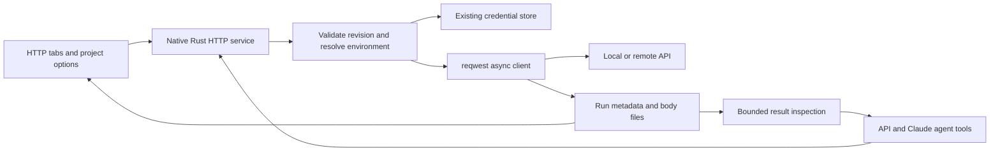

# Native HTTP client for Jarvis

Research date: 2026-09-29. Status: **implemented under epic `jarvis-1hsi`**. Research Bead: `jarvis-qwpc`. This document preserves the original design proposal; see [HTTP-CLIENT.md](HTTP-CLIENT.md) for the delivered interface and scope.

The preceding Chromium extension work was committed and pushed as `d05ba40`. This proposal is a separate feature.

## Recommendation

Build a small native HTTP workspace, with one Rust execution service shared by the UI and agents. Reuse the existing `reqwest` dependency, database, credential stores, chat tabs and tool dispatcher. Do not embed another API client, run a Node daemon, or make curl/Python the execution backend.

The distinguishing behavior is a shared, preserved execution: the user can send a request, inspect its response, and ask an agent to analyze **that exact result without sending the request again**. Likewise, an agent's request becomes visible and editable in the HTTP workspace.

## User experience and first-version scope

### HTTP tabs in the chat

The same surface that contains Chat, files and browser tabs gains HTTP tabs. Each tab has:

- A request name, environment selector, method, URL, **Send** and **Cancel**.
- **Params**, **Headers**, **Authentication** and **Body** sections. Query/header rows can be enabled independently and retain duplicate keys.
- No auth, Basic, Bearer and API key, with configurable key name and header/query destination.
- Empty, JSON, text, URL-encoded, multipart and binary-file bodies. Multipart uses the existing library's optional feature, not another HTTP stack. Uploads reference UI-selected files or paths admitted by the agent's existing filesystem scope; binary data is not embedded in tool arguments.
- A response area with status, duration, received/stored size, final URL, response headers, formatted JSON or inert text, and binary download/save.
- Saved requests, recent execution history, copy/save result and **Analyze with AI**. Sending again creates a new execution; editing the request does not rewrite old results.

Agent execution updates the corresponding tab and activity history. Background completion must not steal focus from another request or the chat. Selecting Chat must preserve the HTTP draft. Closing a tab must not silently replay or lose an in-flight request: its cancellation and retained history are explicit lifecycle operations.

**Analyze with AI** inserts a compact reference to the selected `runId` into the conversation/composer, following normal send/queue behavior. It does not silently initiate a new chat or dump the entire response into the model context.

### Project Options → HTTP client

Add one section to the existing Project Options sidebar, containing:

| Configuration | Behavior |
|---|---|
| Shared variables | Available to every environment **within this project**, not across unrelated projects. |
| Environments | User-created name/color and variables, such as Development, Staging or Production. The selected environment is visible in each request tab. |
| Request defaults | Connection/read timeout, optional total deadline, redirect behavior and response/history retention. Show advanced transport options without crowding the main request form. |
| Credentials | Secret-marked values use the existing OS credential storage, with UI masking and a separate local reference. |
| Export/import | Versioned project HTTP configuration and saved requests. Secret values and response bodies are excluded by default. |

Use a short, predictable variable model:

```text
{{base_url}}/orders
Authorization: Bearer {{token}}

shared project values < selected environment values
```

The environment wins on duplicate names. A missing variable is reported before network activity, with its name and scope. No implicit fallback to Production and no automatic access to the machine's process environment. Initial templating is interpolation, not JavaScript or an expression runtime. Query/form values are encoded by their serializers; JSON is validated after interpolation. Distinguish a missing variable from an intentionally empty value.

An explicit per-run override can be supported without adding another persistent hierarchy of global/folder/runtime variable scopes. That override must be visible in the captured execution. This is optional convenience, not a prerequisite for the two requested scopes.

“Shared/public” describes availability across environments. **Secret** describes confidentiality; either scope can contain a secret. They must be separate controls.

## Proposed architecture



No network await holds the database mutex. Reuse clients for compatible transport settings and connection pooling, but never put request credentials into a process-global client's default headers. Cookie state, if introduced later, must be isolated by project/environment; the first version can expose explicit Cookie/Set-Cookie headers without silently inheriting a browser session.

### Ownership and persistence

| Object | Owner and lifecycle |
|---|---|
| HTTP configuration, environments, saved requests | Project; persist in the existing versioned database. |
| Open request draft | Conversation; a copy of a saved request or an unsaved request. Editing it does not silently change another chat's request. |
| Execution / `runId` | Conversation and project, linked to a specific draft revision. Becomes terminal once and preserves the selected environment revision and redacted request snapshot. |
| Response bytes | Dedicated local run-body storage, referenced by metadata. Supports empty responses and arbitrary binary content without conversion. |
| Credential value | Existing platform credential store under a dedicated HTTP namespace; database stores references. |

Use expected revisions for UI/agent edits. Once a send starts, its request and variable resolution are frozen; changing a tab or environment does not change the in-flight request. A conflict returns the current revision instead of overwriting manual edits.

Keep sensitive response bytes local. Agent-facing reads, ordinary exports and chat metadata redact known substituted secrets and sensitive headers. Redaction is not a guarantee that arbitrary business data in a response is non-sensitive; do not send bodies to external indexers or services automatically. Explicit raw export is a separate user action.

On restart, an unfinished run becomes **interrupted**, retaining partial data where available. It is never automatically resent. Retention limits apply to stored diagnostics and should be visible/configurable, with explicit expired/truncated states; they are not an arbitrary deadline for an agent task.

### Compact tool surface

| Tool | Purpose |
|---|---|
| `http_requests` | Discover environments/variable names and list/read requests or drafts within the authorized scope. Read-only; secret plaintext is not returned. |
| `http_save_request` | Create or edit a saved request or draft, with scope and expected-revision checks. Does not send it. |
| `http_send` | Execute a draft, or an inline specification first registered as a visible draft. Returns `runId`, transport outcome, HTTP status, timing, size and a bounded preview. |
| `http_result` | Inspect a particular run's summary, headers or body segment/structured selection without executing it again. |
| `http_cancel` | Cancel the identified active run. Report that cancellation cannot undo effects already performed by the server. |

These names were adopted by the implementation. `http_send` accepts an existing draft ID and revision; inline definitions are prepared first with `http_save_request`. Discovery, argument validation, effects, permissions, UI labels and both executor paths are registered together. Sending requests follows the existing autonomy/YOLO and role policies. Inspection and editing/sending remain distinct tools because current admission classifies effects by tool name, not arguments. Response text is evidence, never authorization or an instruction to execute another call.

`http_send` should publish the run immediately. It can return a running handle for a slow response so the chat and HTTP UI remain responsive; completion is event-driven. A tool timeout or agent cancellation must not turn into an invisible retry or abandon an untracked request.

## Transport decisions and failure semantics

1. **Native Rust, not WebView fetch.** This avoids browser CORS constraints and supports localhost/private development APIs. It does not bypass server authorization, TLS, VPN, proxy or operating-system restrictions. Agent calls must honor an explicit network-deny policy at the service boundary: a child-process sandbox does not enclose HTTP requests made by the Rust host.
2. **HTTP errors are useful results.** Preserve 3xx/4xx/5xx status, headers and body. Only DNS, connection, TLS, decoding/stream transport failures and cancellation are transport outcomes. Do not call `error_for_status()` and discard the response the user is trying to debug.
3. **No implicit replay.** Configure retry policy deliberately, preferably `reqwest::retry::never()` for the initial tester. `reqwest` otherwise retries certain low-level safe protocol failures. If a response is lost after dispatch, mark the server outcome unknown, including for cancellation; HTTP method alone cannot prove that nothing happened.
4. **Connection/read deadlines and cancellation.** Bound stalled connection and body reads; offer a configurable optional total request deadline. Distinguish queue time from actual network elapsed time using monotonic timing. No hard-coded three-minute implementation/agent deadline.
5. **Redirects are deliberate.** Default to exposing the initial 3xx. If following is enabled, bound hops, record the chain, apply HTTP method/body rules, and strip Authorization, Cookie and secret-derived custom headers across origin changes. Do not forward a secret request body or query value to another origin implicitly. Never silently downgrade HTTPS with credentials.
6. **TLS/proxy are explicit settings.** Verify certificates by default. Custom CA/proxy settings should use the library and existing platform facilities; any insecure local-development exception must be explicit and scoped, never an automatic fallback. Check enabled Cargo features before promising system-proxy behavior.
7. **Read responses incrementally.** Enforce byte/storage limits while receiving, not after allocating a huge body. Preserve MIME, byte count and truncation/partial flags. Do not convert JSON to Markdown or execute response HTML/scripts in an embedded view.
8. **One configured request means one configured request.** No alternate URLs, `.md` variants, scraping services, inferred auth endpoints or Python/curl fallbacks. A request definition is authoritative.

## Existing Jarvis integration map

Paths/lines were inspected at `d05ba40`:

| Existing component | Reuse / gap |
|---|---|
| `src/components/files/FileWorkspace.tsx:35` | Existing mixed file/browser tabs; add HTTP tab identity/content without unmounting Chat. |
| `src/components/chat/ChatArea.tsx:34` | Conversation-owned controller wiring; subagents use the root conversation identity. |
| `src/hooks/use-browser.ts:16` | Generation-based refresh/events; carry run/draft identity and revision for HTTP, avoid background focus theft. |
| `src/components/dashboard/ProjectOptions.tsx:25` | Existing section registry and preserved visited panels; add HTTP client here. |
| `src-tauri/src/persistence.rs:231` | Versioned migrations and foreign keys; `:537` serializes database access. Never await HTTP inside that lock. |
| `src-tauri/src/library/repositories.rs:223` | Existing scoped transaction/ownership pattern. Validate project/conversation before resolving a secret or sending. |
| `src-tauri/Cargo.toml:40` | `reqwest` 0.13.4 already declared with blocking/rustls/json. Async use is available; explicitly add optional multipart features as required. |
| `src-tauri/src/agent/provider.rs:283` | Connect/read timeout and disabled redirects already used for inference. Its client is private/provider-specific, not a ready generic API tester. |
| `src-tauri/src/agent/workflow.rs:736` and `:993` | Tool catalog and common dispatch for API and Claude executors. Integrate the HTTP service through both UI commands and this path. |
| `src-tauri/src/agent/tool_contract.rs:50`, `workflow/contracts.rs:146`, `workflow/custom.rs:119`, `workflow/catalog/permissions.rs:171` | Catalog, effects, permission discovery and labels must agree; adding only an execute branch is insufficient. |
| `src-tauri/src/mcp/mod.rs:139` | Existing cross-platform secret facilities; reuse underlying Keychain/DPAPI/Secret Service handling with an HTTP namespace. |
| `src-tauri/src/backup.rs:121` | Current backup payload covers global settings/catalog/models/skills/MCP, **not project options/data**. HTTP export/import needs an explicit contract. |
| `src-tauri/src/agent/attachments.rs:208` | Attachment conversion rejects empty/unsupported content and is not a lossless response store. Do not reuse it for 204 or arbitrary binary responses; reuse it only when deliberately publishing an image/report attachment. |

## Reference comparison

### Required local references

- **Codex:** `docs/codex/codex-rs/http-client/src/request.rs:77` provides a structured method/URL/headers/body/timeout contract; `:113` prepares body bytes consistently. `route_aware_redirect.rs:49` handles status-specific redirect rules and `:98` strips auth/cookies across scheme/host/port changes, covered by `route_aware_redirect_tests.rs:192`. These are the main transport references.
- **Codex limits:** `http-client/src/transport.rs:114` and `:139` turn non-2xx into errors; that behavior must change for an API tester. `codex-client/src/retry.rs:22` classifies retryable responses but is not a generic idempotency policy for user APIs. `http-client/src/transport_tests.rs:20` is useful for sensitive-log regression tests.
- **OpenCode:** `docs/opencode/packages/opencode/src/tool/webfetch.ts:13` exposes URL/format/timeout and always GETs at `:76`. It is a content reader, not an authenticated request client. `tool/tool.ts:120` is useful for shared validation and bounded outputs with references to larger content. Bound the entire body read, not just response headers.
- **OMP:** `docs/omp/packages/coding-agent/src/tools/fetch.ts:1606` and `:1728` preserve larger artifacts and return bounded previews. `web/scrapers/types.ts:149` and `:196` demonstrate cancellation and bounded streaming; `packages/utils/test/fetch-retry.test.ts:95` covers abort during backoff. Do not adopt alternate extraction endpoints or fallback scraping for configured API calls.

None of these inspected paths provides the complete proposed HTTP UI, environment manager and shared immutable result contract. Those are Jarvis-specific design work, informed by the references rather than copied code.

### Public primary sources verified live

| Source | What to adopt |
|---|---|
| [Bruno variables](https://docs.usebruno.com/variables/overview) | More-specific scopes override common values. Jarvis should use fewer scopes to keep configuration understandable. |
| [Insomnia environments](https://developer.konghq.com/insomnia/environments/) | Base/common values with environment overrides; explicit private environment handling. |
| [Bruno secret variables](https://docs.usebruno.com/secrets-management/secret-variables) | Secrets stored separately from portable environment definitions; excluded from ordinary export. |
| [Postman authorization types](https://learning.postman.com/docs/use/send-requests/authorization/authorization-types/) | No auth, Basic, Bearer and named API keys in headers/query provide a useful initial set. |
| [Postman request parameters](https://learning.postman.com/docs/use/send-requests/create-requests/parameters/) | Separate query, form, multipart, raw and binary encodings instead of guessing Content-Type. |
| [Bruno history](https://docs.usebruno.com/send-requests/history) | Revisiting executed requests is valuable. Immutable `runId` semantics are our proposal, not a claim about Bruno's documented implementation. |
| [reqwest 0.13.4 ClientBuilder](https://docs.rs/reqwest/0.13.4/reqwest/struct.ClientBuilder.html) | Independent connection/read/total timeouts, redirect/proxy/TLS configuration. Defaults need explicit review. |
| [reqwest retry](https://docs.rs/reqwest/0.13.4/reqwest/retry/index.html) | Built-in retry behavior and explicit `never()` policy. |
| [reqwest Response](https://docs.rs/reqwest/0.13.4/reqwest/struct.Response.html) | Incremental `chunk()` reads and preservation of status/headers/body. |
| [reqwest Client](https://docs.rs/reqwest/0.13.4/reqwest/struct.Client.html) | Reuse clients/connection pools; clone is already internally reference-counted. |

Bruno's inspected repository license is [MIT](https://raw.githubusercontent.com/usebruno/bruno/main/license.md); Insomnia's is [Apache-2.0](https://raw.githubusercontent.com/Kong/insomnia/develop/LICENSE). This proposal ports concepts only and adds neither codebase as a dependency.

## Scope kept for later

Do not add a JavaScript pre/post-request runtime, collection runner, cloud/team synchronization, mocks, specialized GraphQL/gRPC/WebSocket clients, or a full OAuth authorization wizard to the first version. They introduce separate lifecycle and execution contracts. Ordinary HTTP can already send GraphQL POST bodies and call documented token endpoints explicitly; a supplied token works with Bearer auth. Keep dedicated streaming-protocol UX and cookie jars separate from the initial HTTP request/response scope.

Importing arbitrary Postman/Insomnia formats and parsing every shell dialect of curl are also separate compatibility work. A versioned native JSON export/import is sufficient initially.

## Implementation and validation boundaries

The work divides into project data/environments/secrets, Rust transport/run storage, tabs/settings UI, agent integration, and final failure-path/export validation. Each implementation area includes its own focused tests; the final step joins the paths rather than postponing testing until the end.

One local HTTP test server can cover repeated headers/query keys, auth redaction, environment overrides/missing values, 204, binary/large bodies, 400/500, credential-safe redirects, delayed headers/body, interruption after server mutation, cancellation and response retention. UI tests cover multiple tabs, user/agent revision conflicts, environment changes during execution, selection of an older result for AI and completion without focus theft. Verify the common dispatcher for both API and Claude tools.

Native proxy/TLS/credential-store behavior still needs platform validation on macOS, Windows and Linux; successful unit tests do not certify every corporate proxy or certificate setup. The implementation includes focused tests and the repository's full frontend and Rust gates.
