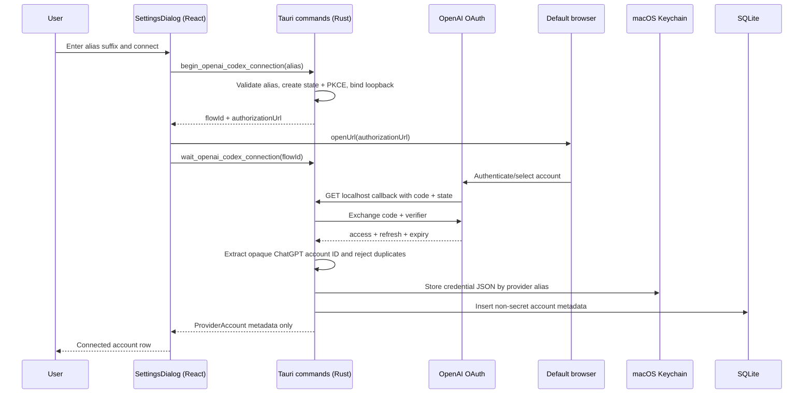

# Implementation plan — multi-account ChatGPT Codex providers

## Objective

Deliver Jarvis's first real provider integration on macOS. The Settings dialog must let a user connect multiple independent ChatGPT Plus/Pro accounts through the OpenAI Codex browser OAuth flow, assign each account a stable provider alias, persist non-secret metadata in the existing Rust-owned SQLite database, and keep OAuth credentials in macOS Keychain. A connected alias establishes the future model namespace, for example `openai-codex-pessoal/gpt-5.6-luna`.

This epic covers account management and the account-specific model catalog in Settings and chat. It preserves each model's reasoning capabilities and default. It does not send prompts or implement the agent loop; model selection remains local UI state.

## Original baseline / Desired

| Area | Current evidence | Desired |
|---|---|---|
| Settings entry point | `src/components/layout/Sidebar.tsx` emits Sonner `Em breve` | Clicking `Configurações` opens one accessible shadcn Settings dialog owned by `Home`. |
| Provider UI | No provider settings exist | `Provedores` shows loading, error, empty and connected-account states, plus `Adicionar conta`. |
| Provider identity | Chat model options are mock data | Every connected account receives an immutable alias in the form `openai-codex-<suffix>`; the canonical model key is `<alias>/<model-id>`. The chat selector uses real account models and supported reasoning options. |
| Persistence | `app_config` is the only SQLite table | A generated migration adds provider account metadata without touching the historical initial migration. |
| Secrets | No provider credentials exist | Access and refresh tokens are stored only in macOS Keychain; SQLite and the frontend never receive them. |
| Rust runtime | Tauri exposes onboarding commands and the opener plugin | Rust owns alias validation, OAuth state/PKCE, loopback callback, token exchange, credential storage and account lifecycle. |
| Browser auth | Opener capability is already enabled | Jarvis opens the system default browser and waits for the loopback callback with cancel, timeout and retry behavior. |
| Metis reference | Metis supports one credential per provider ID in `auth.json` | Reuse its Codex protocol decisions, but make account alias the provider ID and use secure native secret storage. |

## Outcomes and traceability

- **OUT-001 — Settings surface.** `Configurações` opens a pt-BR Settings dialog with a functional `Provedores` section, account list and add/disconnect actions. Requirements: REQ-001–REQ-004. Task: T-003.
- **OUT-002 — Multi-account connection.** Users can connect two or more distinct ChatGPT Plus/Pro accounts, each under a unique immutable alias, through the default browser. Requirements: REQ-005–REQ-009. Tasks: T-001/T-002/T-003.
- **OUT-003 — Secure durable storage.** Relaunch preserves account metadata and credentials without writing tokens to SQLite, files, logs or IPC. Requirements: REQ-010–REQ-012. Tasks: T-001/T-002.
- **OUT-004 — Stable model namespace.** Each account exposes a deterministic provider namespace such as `openai-codex-1`, making `openai-codex-1/gpt-5.6-luna` distinct from `openai-codex-2/gpt-5.6-luna`. Requirement: REQ-013. Tasks: T-001/T-003.
- **OUT-005 — Honest failure handling.** Cancellation, denial, timeout, callback mismatch, occupied callback ports, duplicate account and persistence failures never create a false connected account and remain recoverable in Settings. Requirements: REQ-014–REQ-017. Tasks: T-002/T-003/T-004.
- **OUT-006 — Account-specific model catalog.** Settings cards expose email, account type and available models; the chat selector groups models by alias and offers only their reported reasoning levels. Requirements: REQ-018–REQ-020. Task: T-005.

## Scope

1. One Settings dialog with one implemented section: `Provedores`.
2. One provider kind: OpenAI Codex via ChatGPT Plus/Pro subscription OAuth.
3. Multiple account records differentiated by a user-defined provider alias.
4. Browser authorization-code flow with PKCE, CSRF state and loopback callback.
5. SQLite metadata migration and macOS Keychain credential storage.
6. Typed Tauri commands for list, begin, wait, cancel and disconnect.
7. Observable React tests, deterministic Rust tests, documentation and native macOS smoke.
8. Account profile and model discovery, credential refresh for discovery, model-specific reasoning selection and coherent account updates in chat.

## Non-goals

- No API-key authentication, Claude, Gemini, OpenRouter, custom base URLs or generic provider registry.
- No device-code flow or manual authorization-code paste in this slice; desktop browser plus loopback is the supported path.
- No prompt execution, streaming, quotas, usage display or billing. Credential refresh for catalog discovery is implemented; inference remains a separate feature.
- No alias rename. The alias is a durable identity; disconnect and reconnect under a new alias is sufficient before sessions reference it.
- No Windows/Linux credential backend or cross-platform abstraction beyond a clear unsupported-platform error.
- No plaintext `auth.json`, credentials file, token columns, frontend token state or generic SQL IPC.
- No router or global frontend store. `Home` owns dialog visibility; the dialog owns its local workflow state.
- No edits under `docs/metis`.

## Architecture



## Decisions / trade-offs

- **D-001 — Account lifecycle and catalog.** Account management and model discovery share the existing provider flow. Settings and chat consume one typed catalog; chat message execution remains the existing demo flow.
- **D-002 — Alias is the provider identity.** The form visually fixes the prefix `openai-codex-` and asks for a lowercase suffix such as `1`, `pessoal` or `empresa`. Rust constructs and validates the full alias. It is unique, case-normalized and immutable. This directly supports `<provider-alias>/<model-id>` without another mapping layer.
- **D-003 — SQLite metadata, Keychain secrets.** The existing database stores alias, provider kind, opaque ChatGPT account ID and creation time. macOS Keychain stores versioned OAuth credential JSON. Plaintext files are simpler, as in Metis, but unacceptable for a desktop GUI that already targets macOS and can use native secret storage.
- **D-004 — Provider-specific Rust module, no registry yet.** Add one `openai_codex` module and one narrow secret-store boundary for deterministic tests. Do not add provider traits, factories, plugin manifests or provider configuration. The second real provider is the trigger for a registry.
- **D-005 — Metis/official Codex browser protocol.** Use the public Codex OAuth client ID, `https://auth.openai.com/oauth/authorize`, `https://auth.openai.com/oauth/token`, authorization code + PKCE S256, random state, `openid profile email offline_access`, `id_token_add_organizations=true`, `codex_cli_simplified_flow=true`, and `originator=jarvis`. Bind `127.0.0.1` and advertise `http://localhost:<port>/auth/callback`.
- **D-006 — Allow-listed loopback ports and one active flow.** Try port `1455`, then official Codex fallback `1457`; fail before opening a browser if both are unavailable. Only one login attempt can run because the callback port is process-global. Begin/wait/cancel is smaller than an event bus and keeps PKCE/state in Rust.
- **D-007 — One modal, internal views.** Compose the installed shadcn `Dialog`, `Card`, `Button`, `Badge`, `InputGroup`, `AlertDialog`, `ScrollArea`, `Skeleton` and Sonner. Add registry `Field`, `Empty` and `Spinner` only if absent. The same dialog switches between list, alias form and waiting state; nested custom modals are unnecessary.
- **D-008 — No secret-bearing diagnostics.** Errors cross IPC as a stable code plus a pt-BR-safe message. Never include authorization code, state, callback query, access token, refresh token, raw token response or Keychain payload. Frontend never parses error text for control flow.
- **D-009 — Refresh at discovery time.** Account listing refreshes credentials nearing expiry in Rust. The existing OAuth manager serializes account enrichment/refresh, connection commits and disconnects to prevent concurrent rotation or recreating a disconnected credential. All blocking work stays on background threads.
- **D-010 — Provider-owned reasoning capabilities.** Preserve reported efforts and defaults through Rust IPC and frontend types. Accept effort strings and objects containing `effort`, trim and deduplicate in provider order, and retain only bounded ASCII identifiers. Do not infer levels from model names. An absent list may use the reported default as its sole option; an explicit empty/invalid list has no options. An unsupported default becomes null. The UI uses the valid default or first option and revalidates its selection when accounts or capabilities change.

## Contracts

### C-001 — Provider alias

- UI shows immutable prefix `openai-codex-`; user enters a suffix.
- Suffix: lowercase ASCII letters, digits and internal hyphens; 1–32 characters; regex `^[a-z0-9]+(?:-[a-z0-9]+)*$`.
- Full alias: `openai-codex-<suffix>`.
- Examples: `openai-codex-1`, `openai-codex-pessoal`, `openai-codex-empresa`.
- Canonical future model key: `<full-alias>/<model-id>`, e.g. `openai-codex-pessoal/gpt-5.6-luna`.
- Rust is authoritative. UI mirrors the rule for immediate accessible feedback.
- Duplicate aliases are rejected. Connecting the same ChatGPT `account_id` under another alias is also rejected.

### C-002 — SQLite schema and migration

Drizzle remains the schema/migration source of truth. Generate a new migration; never edit `drizzle/0000_heavy_tomas.sql`.

```sql
provider_accounts (
  alias         TEXT PRIMARY KEY,
  provider_kind TEXT NOT NULL CHECK (provider_kind = 'openai-codex'),
  account_id    TEXT NOT NULL UNIQUE,
  created_at    INTEGER NOT NULL DEFAULT (unixepoch())
)
```

All aliases are validated and lowercased before insertion, so SQLite's ordinary uniqueness is sufficient. Rust registers the generated SQL as migration version 2 in the existing ordered `MIGRATIONS` list. No credential, email, display name, status cache or speculative settings columns are added.

### C-003 — Keychain credential

- Keychain service: `com.foxtag.jarvis.openai-codex`.
- Keychain account: full provider alias.
- Secret value: JSON `{"version":1,"access":"…","refresh":"…","expires":<epoch-ms>,"accountId":"…"}`, with optional `email` and `planType` profile fields. Existing entries without profile fields remain readable.
- Only Rust serializes/deserializes this value.
- A connection is committed only after token exchange, account-ID extraction, duplicate check and successful Keychain write. If the following SQLite insert fails, Rust removes the newly written Keychain item.
- Disconnect removes the Keychain entry first, treating an already-missing entry as success, then deletes SQLite metadata. This prioritizes secret deletion over stale display metadata.

### C-004 — OAuth lifecycle

1. `begin` validates the alias, rejects duplicates/another active attempt, generates 64 random PKCE bytes and random CSRF state, binds loopback, and returns the authorization URL.
2. React opens that exact URL with the already-installed Tauri opener plugin and immediately calls `wait`.
3. Callback accepts only `GET /auth/callback`; unknown routes return 404. Missing/mismatched state returns 400 and keeps the attempt uncommitted. OAuth denial becomes a typed failure.
4. Exchange uses HTTPS and form-encoded `authorization_code`, public client ID, code, verifier and exact redirect URI.
5. Rust requires non-empty access token, refresh token and numeric `expires_in`, decodes the base64url JWT payload only to obtain the nested claim `https://api.openai.com/auth` → `chatgpt_account_id`, then performs storage C-003.
6. The browser receives a small local success/error HTML page with no secrets.
7. Attempt timeout: 10 minutes. Cancel and timeout close the listener and clear managed state. Cancel is idempotent.
8. `Abrir navegador novamente` reopens the same authorization URL while the attempt is active; it does not create a second flow.

### C-005 — Tauri IPC

```text
list_provider_accounts() -> Result<ProviderAccount[], ProviderError>
begin_openai_codex_connection(alias: string) -> Result<{ flowId, authorizationUrl }, ProviderError>
wait_openai_codex_connection(flowId: string) -> Result<ProviderAccount, ProviderError>
cancel_openai_codex_connection(flowId: string) -> Result<(), ProviderError>
disconnect_provider_account(alias: string) -> Result<(), ProviderError>
```

`ProviderAccount` contains `alias`, `providerKind`, `createdAt`, nullable `email`, `accountType` (`personal`, `enterprise`, `unknown`), `modelsAvailable` and `models`. Each `ProviderModel` contains `id`, `name`, `reasoningLevels: string[]` and `defaultReasoningLevel: string | null`. A non-null default must belong to the reported levels. The frontend validates these fields at the IPC boundary. No access/refresh token or opaque account ID crosses IPC. The alias itself is the model namespace. `ProviderError` contains a stable non-secret `code` and user-safe `message`. No command accepts SQL, filesystem paths, tokens, provider URLs or arbitrary provider kinds.

### C-006 — Settings UI states

- Opening: dialog shell plus provider-list skeleton.
- Empty: `Nenhuma conta conectada` and `Adicionar conta`.
- List: one card per alias with `Conectada`, email, account type, connection date, available models/count and `Desconectar`. Missing profile values, an empty catalog and a failed catalog query have distinct messages.
- Add: alias suffix field, computed full-alias preview, subscription explanation and `Conectar com ChatGPT`.
- Waiting: `Aguardando autenticação no navegador`, `Abrir navegador novamente` and `Cancelar conexão`; primary form controls are disabled.
- Success: return to refreshed list and Sonner `Conta conectada`.
- Failure: remain in the add flow with the safe error and retry enabled.
- Disconnect: shadcn `AlertDialog`; success refreshes the list and emits `Conta desconectada`.
- Closing Settings during an active attempt cancels it before closing.

## Requirements and mapping

| ID | Executable requirement | OUT | Task |
|---|---|---|---|
| REQ-001 | Replace the Sidebar `Em breve` handler with a callback that opens the Settings dialog; `Home` owns open/closed state. | OUT-001 | T-003 |
| REQ-002 | Build the accessible shadcn Settings dialog with visible title `Configurações` and implemented section `Provedores`. | OUT-001 | T-003 |
| REQ-003 | Load provider accounts on open and render skeleton, retryable error, empty and list states without fake data. | OUT-001 | T-003 |
| REQ-004 | Provide add and confirmed disconnect actions with pt-BR labels, focus behavior, disabled pending states and Sonner feedback. | OUT-001 | T-003 |
| REQ-005 | Enforce C-001 in Rust and mirror it in the form; never silently rewrite invalid input. | OUT-002/OUT-004 | T-001/T-003 |
| REQ-006 | Support at least two simultaneous persisted aliases of provider kind `openai-codex`. | OUT-002 | T-001/T-002 |
| REQ-007 | Start browser OAuth with PKCE/state and the provider-specific URL contract in C-004. | OUT-002 | T-002 |
| REQ-008 | Open the authorization URL in the default browser, wait without freezing the UI, and allow reopen/cancel. | OUT-002 | T-002/T-003 |
| REQ-009 | Reject a second active flow and duplicate ChatGPT account without changing existing accounts. | OUT-002/OUT-005 | T-002 |
| REQ-010 | Add `provider_accounts` through a newly generated immutable Drizzle migration and apply it as schema version 2. | OUT-003 | T-001 |
| REQ-011 | Store OAuth secrets only in macOS Keychain under C-003; tokens never enter SQLite, files or React. | OUT-003 | T-001/T-002 |
| REQ-012 | Relaunch must list previously connected aliases; disconnect removes local secret and metadata. | OUT-003 | T-001/T-003/T-004 |
| REQ-013 | Use the stable account alias to namespace model IDs in the chat selector. | OUT-004 | T-001/T-003/T-005 |
| REQ-014 | Denial, timeout, cancellation, bad callback state, malformed token response and occupied ports leave no account row/secret. | OUT-005 | T-002 |
| REQ-015 | Keychain or SQLite failure returns a redacted typed error and performs the compensation defined in C-003. | OUT-005 | T-001/T-002 |
| REQ-016 | Blocking SQLite, loopback and Keychain operations stay off the UI thread; the OAuth wait is cancellable. | OUT-005 | T-001/T-002 |
| REQ-017 | Tests, quality gates, docs and native smoke prove the behavior without real credentials in automated tests. | OUT-001–OUT-005 | T-004 |
| REQ-018 | Settings cards show account metadata and models; chat uses only connected account models. | OUT-006 | T-005 |
| REQ-019 | Reasoning choices/defaults come from each model, including unsupported/missing data and changes to the selected account/model. | OUT-006 | T-005 |
| REQ-020 | Concurrent discovery cannot rotate the same credential simultaneously or recreate it after disconnect; stale startup data cannot replace newer Settings accounts. | OUT-003/OUT-006 | T-005 |

## Tasks, dependencies and likely files

### T-001 — Provider persistence and secret storage (`jarvis-zir.1`)

- Extend `src/db/schema.ts`; generate a new Drizzle migration/snapshot; register migration version 2 in Rust.
- Expose the existing connection helper only at crate scope and add parameterized list/insert/delete account operations.
- Implement C-001 validation as a small domain function.
- Add macOS Keychain storage with one narrow credential-store seam and an in-memory test implementation under `cfg(test)`.
- Cover migration preservation, two aliases, duplicate alias/account, Keychain failure compensation and disconnect behavior.
- **Dependency:** none. **Output:** C-001–C-003 ready for OAuth.
- **Likely files:** `src/db/schema.ts`, generated `drizzle/*`, `src-tauri/Cargo.toml`, `src-tauri/Cargo.lock`, `src-tauri/src/persistence.rs`, and one provider-account Rust module.

### T-002 — Rust-owned OpenAI Codex browser OAuth (`jarvis-zir.2`)

- Add only the direct dependencies required for random PKCE/state, SHA-256/base64url, HTTPS/form exchange, loopback HTTP and Keychain.
- Implement provider-specific constants and C-004 without copying Metis source.
- Add managed one-attempt state and register C-005 commands in `src-tauri/src/lib.rs`.
- Keep provider endpoints internally replaceable in tests so a local fake issuer/token server proves success and failures without external network.
- Test callback routing/state, authorization URL, success, cancellation, timeout, denial, port conflict, malformed token, duplicate account and redaction.
- **Dependency:** T-001. **Output:** complete IPC for Settings.
- **Likely files:** `src-tauri/src/openai_codex.rs`, a small provider command/state module, `src-tauri/src/lib.rs`, Cargo files and Rust unit/integration tests.

### T-003 — Settings provider interface (`jarvis-zir.3`)

- Change `AppSidebar` to receive `onOpenSettings`; remove the obsolete Sonner-only path and its test.
- Let `Home` own Settings visibility and render one `SettingsDialog`.
- Install only missing shadcn registry primitives required by D-007; do not hand-build equivalents.
- Implement C-006 with typed local models/invokes and `openUrl`; tokens never exist in frontend types/state.
- Add colocated behavior tests for open/load, alias validation, browser start/wait success, retry/cancel, two accounts and disconnect confirmation.
- **Dependency:** T-002 IPC. **Output:** OUT-001/OUT-002/OUT-004 visible end to end.
- **Likely files:** `src/components/layout/Home.tsx`, `Sidebar.tsx`, their tests, one new `src/components/settings/SettingsDialog.tsx` plus test, generated `src/components/ui/*` only when absent.

### T-004 — Documentation and native proof (`jarvis-zir.4`)

- Document account metadata, Keychain ownership, alias/model namespace and supported browser flow in `README.md`.
- Run the ordered frontend/Rust gates and native smoke below.
- Use a dedicated test alias and disconnect it after smoke; never print, inspect, screenshot or commit credentials.
- **Dependencies:** T-001, T-002 and T-003. **Output:** verified release-ready slice.
- **Likely files:** `README.md` and directly affected tests only.

### T-005 — Account details, model catalog and reasoning (`jarvis-zir.5`)

- Research Metis capability extraction/selection and OMP Codex catalog discovery; adapt the concepts within the existing Rust provider module.
- Return non-secret email/account type and model capabilities, including the per-model reasoning list and default.
- Render account models in Settings and the chat selector, preserve alias identity, and reconcile selection against updated capabilities.
- Serialize credential lifecycle operations and protect Home against stale startup responses.
- Add observable frontend and Rust regression tests, repair onboarding mocks for the new list command, and align documentation.
- **Dependencies:** T-001/T-002/T-003. **Output:** OUT-006 with clean final gates.

## Risks / mitigations

| Risk | Required mitigation |
|---|---|
| The public Codex OAuth client/redirect allow-list changes | Keep provider constants in one Rust module, test exact URL shape, use only allow-listed ports 1455/1457, and return a clear compatibility error. Do not make endpoints user-configurable. |
| Tokens leak through logs, IPC, SQLite or test failures | C-003/C-005 and D-008 prohibit secret-bearing values; use synthetic tokens in tests and assert serialized account/error responses contain none. |
| A malicious local process sends a callback | Use high-entropy state + PKCE, exact callback route, loopback bind and no commit before state/token validation. |
| Browser never returns or Settings closes | Ten-minute timeout and idempotent cancel close the listener and clear state; no pending DB row exists. |
| Fixed callback port is occupied | Try official fallback 1457; if both fail, stop before browser launch with actionable pt-BR error. |
| Same account is connected twice under different aliases | Extract and uniquely persist opaque `account_id`; reject before Keychain/SQLite mutation. |
| Keychain and SQLite cannot commit atomically together | Write secret then metadata; remove the new secret if metadata insert fails. Disconnect deletes secret first and treats absence as success. |
| Alias rename later breaks session references | Alias is immutable. Add rename only with a transactional reference migration after real session/model tables exist. |
| Tests accidentally require network, browser or Keychain | Inject only test endpoints and an in-memory secret store at the Rust boundary; mock Tauri invokes/opener in React. |
| Provider abstraction grows before a second provider exists | Keep one provider-specific module. Introduce a registry only when provider number two lands with different behavior. |

## Test / validation

### Durable behavior tests

- **Rust migration/repository:** version 2 preserves `app_config`; empty list; two aliases; duplicate alias; duplicate `account_id`; parameterized delete; no token columns.
- **Rust alias:** valid numeric/friendly suffixes; uppercase, whitespace, leading/trailing/double hyphens and overlength rejected; canonical model key example remains distinct across aliases.
- **Rust OAuth:** URL contains exact state/challenge/redirect and no verifier; success through local fake token endpoint; state mismatch keeps storage empty; denial, cancel, timeout, port conflict and malformed response are typed/redacted.
- **Rust secret lifecycle:** secret-store failure creates no metadata; DB failure removes the new secret; disconnect removes both; absent secret is idempotent.
- **Rust catalog:** filter/sort models, retain string/object reasoning efforts and defaults, reject malformed capabilities, avoid invented options, and prevent account enrichment from recreating removed credentials.
- **React catalog:** both model lists, per-model submenu, provider default, explicit disabled reasoning, absent/unknown capabilities, capability updates, account removal and stale startup responses. Bootstrap tests mock account discovery explicitly.
- **React:** Settings opens and loads; empty/list/error states; add form displays computed alias; start invokes browser opener and waiting state; success refreshes list; failure retries; close/cancel invokes backend cancel; two accounts render; disconnect requires confirmation.
- Delete the existing toast-only Settings expectation instead of re-pinning obsolete behavior.

### Final gates

Run in this order after implementation:

1. `bun run check`
2. `cargo clippy -- -D warnings` in `src-tauri`
3. `cargo test` in `src-tauri`

### Native macOS smoke

1. Launch the real Tauri app without deleting existing Jarvis data.
2. Open `Configurações` → `Provedores`; verify the real empty/list state.
3. Enter a dedicated alias suffix, click `Conectar com ChatGPT`, and verify the default browser opens.
4. Complete OpenAI account selection; verify waiting resolves only after callback/token persistence and the alias appears as `Conectada`.
5. Relaunch; verify the account remains listed without re-authentication and no token is visible anywhere in UI/log output.
6. If two real accounts are available, connect the second alias and verify both coexist. Otherwise record that native limitation; the deterministic fake-OAuth test must still prove two distinct account IDs.
7. Attempt the same ChatGPT account under a new alias; verify the duplicate is rejected without damaging the first connection.
8. Start and cancel another flow; verify retry works and no account appears.
9. Disconnect the dedicated smoke alias through confirmation; relaunch and verify it is absent.

Native OAuth cannot be fully automated because account selection requires user interaction. Automated tests prove protocol/state/storage invariants; the smoke proves the real browser/OpenAI/Keychain integration.

## Evidence / references

- Jarvis entry point and layout: `src/components/layout/Sidebar.tsx`, `src/components/layout/Home.tsx`, `src/components/layout/Home.test.tsx`.
- Existing Rust/database ownership: `src-tauri/src/persistence.rs`, `src-tauri/src/lib.rs`, `src/db/schema.ts`, `drizzle/0000_heavy_tomas.sql`.
- Existing browser capability/dependency: `src-tauri/capabilities/default.json`, `package.json`, `src-tauri/Cargo.toml`.
- Metis browser flow and lifecycle reference: `docs/metis/vendor/metis-ai/dist/utils/oauth/openai-codex.js`, `docs/metis/src/core/auth-storage.ts`, `docs/metis/src/modes/interactive/components/login-dialog.ts`, `docs/metis/src/modes/interactive/interactive-mode.ts:5618-5713`, and `docs/metis/docs/providers.md`.
- Metis desktop Settings reference only: `docs/metis/desktop/src/components/settings/SettingsDialog.tsx:419-605` and `AddModelModal.tsx`. Jarvis must use its own shadcn/One Dark composition and must not copy these components.
- Metis model capability/selection reference: `docs/metis/src/core/model-registry.ts` (`extractProviderThinkingOptions`), `docs/metis/src/core/agent-session.ts` (`getAvailableThinkingLevels`, `setThinkingLevel`) and `docs/metis/docs/models.md`. OMP discovery reference: `docs/omp/packages/catalog/src/discovery/codex.ts`.
- Official Codex protocol reference: `openai/codex` `codex-rs/login/src/server.rs`, `pkce.rs`, `token_data.rs`, and `auth/storage.rs`; current official code uses PKCE, state, loopback port 1455 with allow-listed fallback 1457, redacted callback logging and Keychain-capable storage.
- Durable tracking: epic `jarvis-zir`; tasks `jarvis-zir.1` through `jarvis-zir.5`. Validation evidence and remaining work are tracked in Beads.
