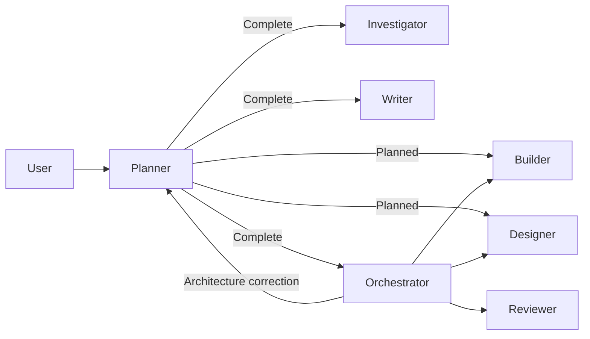

# Native agent workflows

Status: accepted for implementation. Model/account/reasoning are configured per role and flow in Settings > Agents (`~/.jarvis/agents.json`). Planned and Complete require their roster to be configured. The chat picker edits the principal role's selection. Standard can use the chat selection until configured. Tool execution is always automatic (YOLO) throughout the run. Legacy approval fields remain readable; new and resumed turns normalize to YOLO. No installed OMP account aliases are embedded.

## Decision

Keep workflow selection separate from legacy Plan/Build capabilities. Existing journals remain readable; new submissions use Standard, Planned or Complete. Standard runs the Builder in the main session. Planned and Complete run a Planner there and delegate to isolated provider contexts through a native Rust hub.

The fixed contracts adapt the installed OMP workflow's common rules, role topology, outcome evidence and handoffs. Metis contributes the completion barrier: a coordinator cannot finish while its children are active, and completion wakes it without polling. No external plugin files are loaded at runtime.

## Execution and state

Each delegated job has an immutable role, dispatch, acceptance criteria, Beads reference, dependencies, scope and an independent JSONL transcript. The hub freezes configured model profiles at run start; settings changes apply to the next run. The hub uses notifications, a bounded job roster and four concurrent leaf executions. Coordinators do not occupy leaf capacity while waiting. Dependencies must complete successfully before execution. Code-writing jobs with overlapping scopes are serialized; narrow scopes cannot run unrestricted shell or mutating MCP/Context-mode tools. Verification commands are serialized. This is an application capability policy, not an OS sandbox.

Beads remains the authority for task requirements, claims and completion. The hub stores execution state, not a second task tracker. Before execution, it refreshes the assigned Bead and checks blocking dependencies. Reviewers can inspect an unclosed implementation only when its explicit worker dependency has completed with a matching handoff in the current run; durable Beads edges remain intact. Structured handoffs include outcomes, evidence, validation, limitations and exact reviewed task IDs. Full review uses an independent context and the configured Reviewer model; it does not replace user validation. Reviewers exclude overlapping writers for their whole execution. Validation commands exclude project mutations while running; independent writes can otherwise proceed concurrently.

Workflow manifests and worker journals live under `~/.jarvis/workflows/<conversation>/`. Checkpoints are atomically replaced and synced before acknowledging operations. A restart marks unfinished jobs interrupted. Resumption is an explicit hub operation in a subsequent user-authorized turn, preserving the old transcript, checking Beads again and requiring inspection before repeating uncertain actions. Up to two rework/resume rounds per job avoid infinite retries. Cancellation propagates to all descendants; the main turn remains active until workers stop.

## Interface and permissions

The inspector fetches compact metadata; transcripts load only when a read-only modal is opened. Existing transcript components and bounded history pages are reused. Workers retain their own tool approvals and questions, surfaced in the main composer with their identity. No approval is inherited from another tool call. Main-session file revisions also record worker writes so the inspector remains session-scoped.

## Tradeoffs and failure modes

- Shared checkout rather than automatic worktrees: preserves the current project behavior and avoids hidden Git mutations. Overlapping writers queue; independent scopes can run concurrently.
- Explicit resume rather than automatic side-effect replay: interrupted operations may already have changed files or Beads.
- Explicit model choices per flow rather than personal hardcoded aliases: supports all configured providers. Stale/disabled selections fail visibly rather than silently switching accounts.
- Storage failures stop execution. Failed dependencies block descendants. Role/tool checks are enforced at dispatch, independent of provider compliance.
- Worker context includes the original user request, a focused dispatch and its own history. The coordinator supplies relevant references; workers must surface discrepancies instead of silently replacing user criteria. Repository instructions and native skill discovery remain available.

Reference sources (read-only): `docs/metis/src/core/workflow-runtime.ts`, `docs/metis/src/core/agent-session.ts`, `docs/omp/packages/coding-agent/src/tools/hub`, and the user's installed `~/.omp/plugins/local/workflow` contracts.
