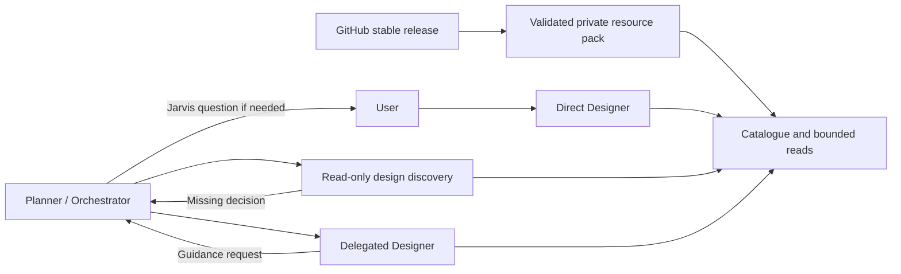

# Open Design resource integration

Status: accepted for implementation.

Jarvis needs reusable design knowledge without embedding another desktop app,
daemon, provider stack or configuration system. Open Design supplies a large
Apache-2.0 collection; its host protocols and catalogue-only skill pointers are
not capabilities that Jarvis can promise.

## Decision

Install a versioned resource pack under `~/.jarvis/core/open-design`. Resolve the
latest stable GitHub release to a commit and download that immutable source
archive over HTTPS. Extract only design systems, templates, craft guides and
substantive skills, preserving licenses and package provenance. Validate paths,
sizes and package identity before atomic activation. Never run lifecycle scripts.
Existing generations remain available to running turns during an update.

The first catalogue includes all packaged design systems/templates and craft
guides, plus `design-brief`, `taste-skill-v1`, `gpt-tasteskill` and
`impeccable-design-polish`. Catalogue-only pointers are excluded. Text references
are readable; JavaScript/Python pipelines, image generation and exports are not
installed as executable capabilities. Downloads are spooled to a temporary file
(512 MB limit); extraction has independent size, path and entry-count bounds.

Native, bounded catalogue and resource-reading tools expose the pack on demand.
The model uses ordinary Jarvis editing tools for project changes, retaining scope
checks and session diffs. Upstream host instructions are reference data beneath
the user's request, project conventions and the Jarvis design contract. Missing
external skill dependencies are not silently installed or advertised as working.

One canonical design contract applies to direct and delegated Designers, including
after compaction. It reuses existing design decisions, asks only material missing
questions, selects relevant resources, implements and verifies the result. A
durable brief preserves decisions and references across turns and compaction.

Direct Designer uses Jarvis questions. Delegated Designers request guidance from
their parent through durable, correlated hub messages; they cannot ask the user.
The parent resolves the request from known context or escalates to the user.
Read-only design discovery may precede Beads creation when design decisions are
prerequisites for planning. Implementation still requires an assigned Bead.

## Tradeoffs and failures

The pack uses more disk space than a small curated prompt but preserves access to
diverse resources without filling every context window. It does not include the
Open Design editor, browser, exports, image generation or host-dependent scripts.
Jarvis only claims verification performed with its actual tools.

Failed downloads, incompatible packages and invalid paths leave the current
installation active. Cancellation interrupts guidance waits; restart records an
interrupted worker for explicit recovery instead of silently waiting forever.
Discovery permissions are enforced by the runtime, not solely prompt text.

References: `docs/open-design/docs/prompt-composition.md`, daemon discovery/core
prompts and resource manifests; `docs/metis/docs/agents.md` and resource loader.
